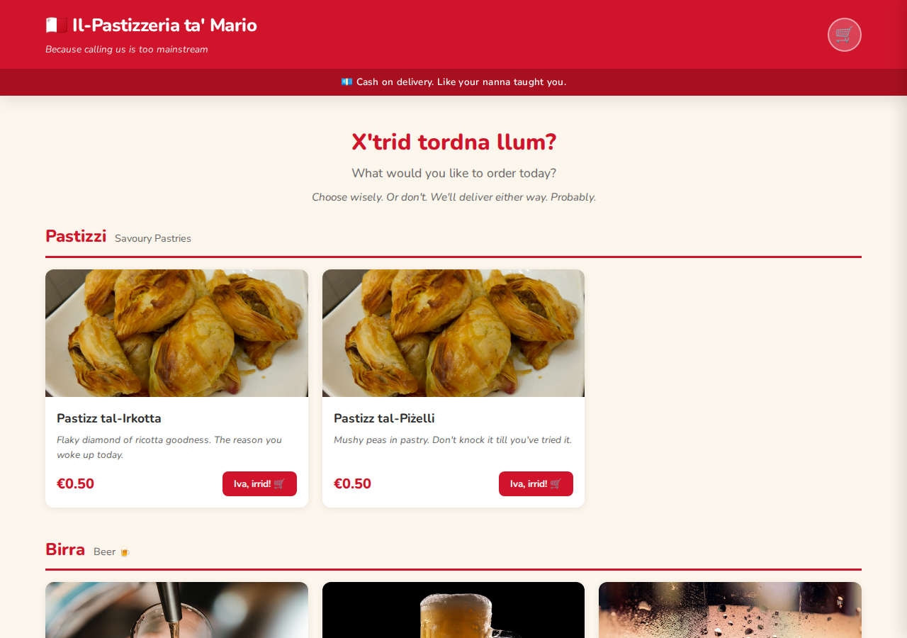
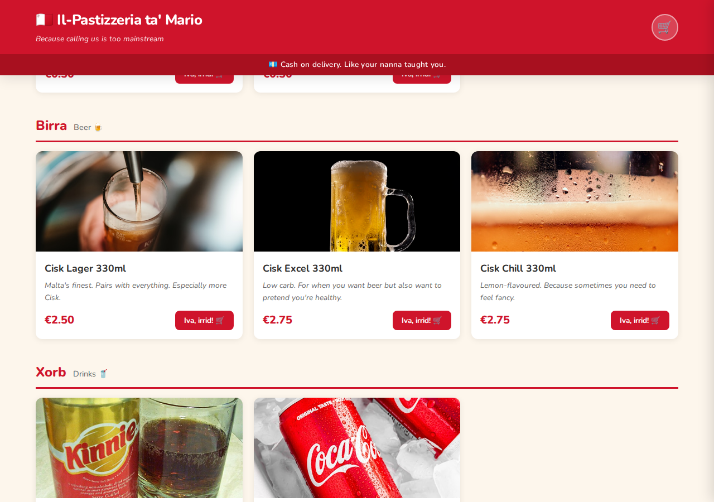

<!-- markdownlint-disable MD013 MD033 MD041 -->

# APEX & Pastizzi at The Perspectives 2026

<div align="center">
  
</div>

> APEX is the Agentic Platform Engineering eXperience for Azure.
> This repository is the live demo workspace for Jonathan Vella's session at
> [The Perspectives 2026](https://tech.bmit.com.mt/the-perspectives-2026).

[](https://tech.bmit.com.mt/the-perspectives-2026)
[](https://jonathan-vella.github.io/azure-agentic-infraops/)
[](https://jonathan-vella.github.io/azure-agentic-infraops/demo/)
[](https://github.com/features/copilot)
[](LICENSE)

## Why This Matters Today

The event theme is practical cloud leadership: reducing complexity, improving resilience,
and making better infrastructure decisions under compliance and cost pressure.

APEX is built for exactly that problem space. It turns a plain-language infrastructure ask
into a structured delivery flow with AI agents doing the preparation work and humans keeping
control over approvals, trade-offs, and deployment decisions.

## What APEX Does

1. Captures business and technical requirements from natural-language prompts.
2. Assesses target architecture against Azure Well-Architected guidance.
3. Discovers governance and policy constraints before code generation.
4. Produces Bicep or Terraform using Azure Verified Modules where possible.
5. Validates outputs and assembles deployment-ready and as-built documentation.

## The Demo: Il-Pastizzeria ta' Mario 🇲🇹

The live demo builds an online ordering app for a fictional Maltese catering outlet that sells pastizzi, Cisk, and Kinnie. Because apparently the best way to showcase enterprise Azure infrastructure is with €0.50 pastries and a delivery driver named Mario.

**The app features:**

- 🥟 11 menu items across 4 categories (Pastizzi, Birra, Xorb, Ikla Oħra)
- 🛒 A cart that judges your life choices (_"Kemm tridu?! Having a festa or what?"_)
- 💶 Cash on delivery only. Like your nanna taught you.
- 🛵 Delivery estimates powered by Mario's coffee schedule
- ⚠️ Side effects may include: spontaneous Maltese pride, carb comas, and saying "mela" in every sentence

> **Live site**: <https://app-malta-catering-dev.azurewebsites.net>

<div align="center">
  
  <br/><em>"X'trid tordna llum?" — What would you like to order today?</em>
  <br/><br/>
  
  <br/><em>Cisk Lager: "Malta's finest. Pairs with everything. Especially more Cisk."</em>
</div>

## Clone & Deploy

### Prerequisites

- An Azure subscription (with credits — the demo uses a P0v3 App Service Plan, so bring your wallet. Or your employer's wallet. We don't judge.)
- [VS Code](https://code.visualstudio.com/) with the [Dev Containers](https://marketplace.visualstudio.com/items?itemName=ms-vscode-remote.remote-containers) extension
- That's it. The devcontainer handles everything else. _Mela._

### Quick Start

**1. Clone & open in Dev Container:**

```bash
git clone https://github.com/jonathan-vella/bmit-2026.git
cd bmit-2026
code .
# F1 → "Dev Containers: Reopen in Container"
```

**2. Log in to Azure:**

```bash
az login
azd auth login
```

**3. Deploy infrastructure** (Bicep via azd):

```bash
cd infra/bicep/malta-catering
azd init -e dev
azd provision
```

This deploys App Service (P0v3), ACR (Premium + private endpoint), VNet, Key Vault, Table Storage, Log Analytics, App Insights, and a budget alert. All AVM-based. All Entra ID. No admin credentials. _Like a proper adult._

**4. Build & push the app container:**

ACR is locked behind a private endpoint, so you need to temporarily open the door, shove the container in, and lock it again. Very Maltese.

```bash
# Get your ACR name from azd outputs (it includes a unique suffix)
ACR_NAME=$(az acr list -g rg-malta-catering-dev --query "[0].name" -o tsv)

# Open the door
az acr update --name $ACR_NAME --public-network-enabled true --default-action Allow

# Cloud-build (no local Docker needed — the devcontainer doesn't have it anyway)
cd app/malta-catering
az acr build --registry $ACR_NAME --image malta-catering-app:latest --file Dockerfile .

# Lock it back up
az acr update --name $ACR_NAME --public-network-enabled false --default-action Deny
```

**5. Configure & start:**

```bash
APP_NAME=$(az webapp list -g rg-malta-catering-dev --query "[0].name" -o tsv)
az webapp config appsettings set -g rg-malta-catering-dev -n $APP_NAME --settings WEBSITES_PORT=8080
az webapp stop -g rg-malta-catering-dev -n $APP_NAME
az webapp start -g rg-malta-catering-dev -n $APP_NAME
```

**6. Open** `https://$APP_NAME.azurewebsites.net`

If the pastizzi are cold, it's because you took too long to open the door.

### What Gets Deployed

| Resource                     | Purpose                                            | SKU          |
| ---------------------------- | -------------------------------------------------- | ------------ |
| App Service Plan             | Hosts the containerized React + Express app        | P0v3         |
| Web App + Staging Slot       | The actual app (managed identity, VNet-integrated) | —            |
| Container Registry           | Stores the Docker image (private endpoint only)    | Premium      |
| Virtual Network              | 2 subnets: app-service + private-endpoints         | /24          |
| Private DNS Zones            | ACR, Key Vault, Storage (3 zones)                  | —            |
| Key Vault                    | App Insights connection string, future secrets     | Standard     |
| Storage Account              | Table Storage for order persistence (future)       | Standard LRS |
| Log Analytics + App Insights | Monitoring and diagnostics                         | Free tier    |
| Budget                       | €500/month alert                                   | —            |

All resources use **Entra ID / managed identity** for authentication. No admin credentials, no shared keys, no "I'll Revolut you later."

## What I Am Showing in the Live Demo

- A real multi-step agent workflow from prompt to Azure delivery artifacts.
- Human approval gates instead of blind automation.
- Architecture, pricing, governance, and implementation decisions in one flow.

### Starter Prompt

Open GitHub Copilot Chat, select the **Orchestrator** agent, and paste:

> **Context:**
> This is a live 30min demo, so we have to keep things short.
> At max 1 adversarial review during requirements & architect phases.

> **What I want to build:**
> The owner of a catering outlet based in Malta (Europe) wants to host an online ordering app in Azure.
> The app is a simple containerized application with React. We can use table storage for persistence. Unless you can think of something better.
> The app will process online orders for pastizzi, Cisk, and Kinnie.
> Payment is strictly on delivery.
> Expectation is 1 transaction per sec.

## Follow Along

| Experience       | Link                                                                                                | What you will find                                       |
| ---------------- | --------------------------------------------------------------------------------------------------- | -------------------------------------------------------- |
| Main site        | [APEX documentation](https://jonathan-vella.github.io/azure-agentic-infraops/)                      | Product overview, workflow, and getting started guidance |
| Demo walkthrough | [Nordic Fresh Foods demo](https://jonathan-vella.github.io/azure-agentic-infraops/demo/)            | Real generated outputs across the full pipeline          |
| How it works     | [Workflow overview](https://jonathan-vella.github.io/azure-agentic-infraops/concepts/how-it-works/) | The agent pipeline, reviews, and approval model          |
| Prompt examples  | [Prompt guide](https://jonathan-vella.github.io/azure-agentic-infraops/guides/prompt-guide/)        | Reusable prompts for agents and common scenarios         |
| Source repo      | [GitHub repository](https://github.com/jonathan-vella/azure-agentic-infraops)                       | The maintained upstream APEX codebase                    |

## Repository Map

```text
app/                # The malta-catering React + Express application
  malta-catering/   #   Source, Dockerfile, server, product images
.github/            # Agents, skills, instructions, prompts, hooks, and workflows
agent-output/       # Generated artifacts for each scenario or project
infra/              # Infrastructure-as-Code
  bicep/
    malta-catering/ #   10 AVM Bicep modules, phased deployment, azd manifest
mcp/                # MCP servers used by the workflow
scripts/            # Validation, sync, and demo support scripts
tests/              # Validation fixtures, prompts, and E2E inputs
```

## After the Session

If you want to keep exploring APEX after the event, start here:

- [APEX documentation site](https://jonathan-vella.github.io/azure-agentic-infraops/)
- [APEX upstream repository](https://github.com/jonathan-vella/azure-agentic-infraops)
- [APEX MicroHack](https://jonathan-vella.github.io/microhack-agentic-infraops/)

## License

[MIT](LICENSE)
