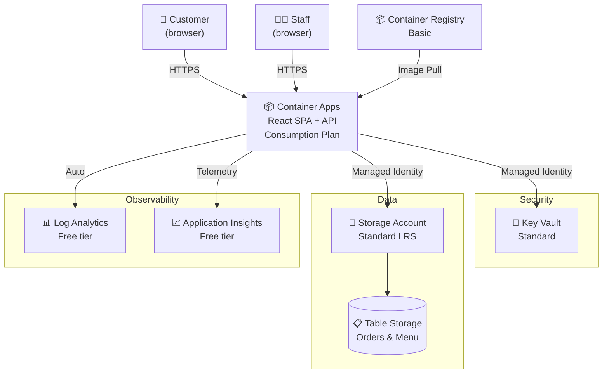
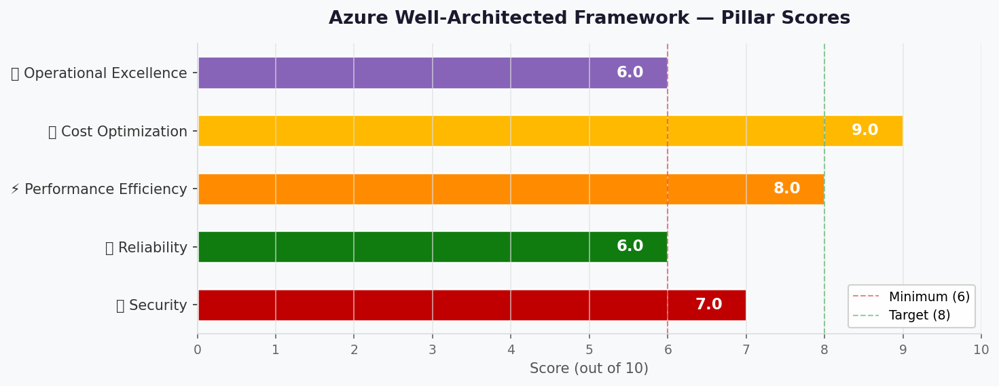

# 🏛️ Step 2: Architecture Assessment - Malta Catering

<strong>📑 Assessment Contents</strong>

- [✅ Requirements Validation](#-requirements-validation)
- [💎 Executive Summary](#-executive-summary)
- [🏛️ WAF Pillar Assessment](#-waf-pillar-assessment)
- [📦 Resource SKU Recommendations](#-resource-sku-recommendations)
- [🎯 Architecture Decision Summary](#-architecture-decision-summary)
- [🚀 Implementation Handoff](#-implementation-handoff)
- [🔒 Approval Gate](#-approval-gate)
- [References](#references)

> Generated by architect agent | 2026-04-14

| ⬅️ Previous                              | 📑 Index            | Next ➡️                                            |
| ---------------------------------------- | ------------------- | -------------------------------------------------- |
| [01-requirements.md](01-requirements.md) | [README](README.md) | [03-des-cost-estimate.md](03-des-cost-estimate.md) |

## ✅ Requirements Validation

| Requirement Area        | Status     | Validation Notes                                        |
| ----------------------- | ---------- | ------------------------------------------------------- |
| NFRs (SLA, RTO, RPO)    | ✅ Defined | 99.0% SLA, 24h RTO, 12h RPO — relaxed for dev/demo     |
| Compliance requirements | ✅ Defined | GDPR applicable; PCI/SOC/HIPAA not in scope             |
| Budget (approximate)    | ✅ Defined | EUR 100-500/month soft limit, consumption preferred     |
| Scale requirements      | ✅ Defined | 1 TPS, 100-1K daily users, up to 1K concurrent         |
| Security controls       | ✅ Defined | Managed identity, Key Vault, TLS 1.2+, no PE/WAF       |
| Data residency          | ✅ Defined | EU-only, swedencentral, no cross-region replication     |

> [!NOTE]
> One open challenger finding from Step 1 (REQ-001: Table Storage lacks native
> backup) is addressed in the Reliability assessment below.

---

## 💎 Executive Summary

A lightweight, cost-optimized ordering portal for a Malta catering outlet
selling pastizzi, Cisk, and Kinnie. The architecture uses **Azure Container
Apps** (Consumption plan) to host a containerized React SPA with a lightweight
API, **Azure Table Storage** for order persistence, **Azure Container
Registry** (Basic) for image management, and **Azure Key Vault** (Standard)
for secrets. All resources deploy to **swedencentral** for GDPR compliance.

Estimated monthly cost: **~$24.53/month** (well within EUR 100-500 budget).

### Recommended Architecture

---

## 🏛️ WAF Pillar Assessment

### Overall Scores

| Pillar                    | Score | Confidence | Summary                                          |
| ------------------------- | ----- | ---------- | ------------------------------------------------ |
| 🔒 Security               | 7/10  | High       | MI + KV + TLS 1.2; no PE/WAF (acceptable for dev) |
| 🔄 Reliability            | 6/10  | Medium     | 99.95% platform SLA exceeds 99.0% target; no backup |
| ⚡ Performance            | 8/10  | High       | 1 TPS is trivial; auto-scale handles spikes      |
| 💰 Cost Optimization      | 9/10  | High       | ~$24.53/mo; consumption-based; scale-to-zero     |
| 🔧 Operational Excellence | 6/10  | Medium     | Built-in logging; no CI/CD or alerting yet       |

**Primary Pillar Optimized**: 💰 Cost Optimization
**Trade-offs Accepted**: No private endpoints (**provisional** — ARC-004),
no WAF, no multi-region. Data loss explicitly accepted for demo (ARC-001).
GDPR erasure pattern defined (ARC-003). Staff access via Entra ID (ARC-005).

---

### 🔒 Security Assessment (7/10)

**Strengths:**

- Managed Identity for Container Apps → Key Vault and Storage (no keys in code)
- Key Vault Standard with RBAC authorization for secrets management
- TLS 1.2+ enforced on Container Apps ingress (managed certificates)
- Platform-managed encryption at rest for Storage and Key Vault
- No PCI scope — payment is strictly cash on delivery
- Container Apps built-in auth supports social IdP (Google, Microsoft) via Easy Auth

**Gaps:**

- ⚠️ Public ingress endpoint (no private endpoints) — **provisional**, pending governance discovery (ARC-004)
- ⚠️ No WAF/DDoS protection — low traffic does not justify cost; **provisional** pending governance
- ⚠️ Social IdP data processing may cross EU boundaries (noted in REQ-002)
- ⚠️ Staff authentication requires a dedicated trust boundary (ARC-005 — see below)

**GDPR Data Erasure Pattern (ARC-003):**

Table Storage entities must separate PII from order facts to support right-to-erasure:

| Partition          | Row Key    | Contains PII | Erasure Action              |
| ------------------ | ---------- | ------------ | --------------------------- |
| `customer_{id}`    | `profile`  | Yes          | Delete entire entity        |
| `order_{date}`     | `{orderId}`| No (anonymized) | Retain (customer_id → hash) |

On erasure request: delete `customer_*` entities, replace `customer_id` with
a one-way hash in order entities. Orders are retained for business records
with no reversible PII.

**Staff Access Trust Boundary (ARC-005):**

Staff operations (view orders, update status) must use a separate
authentication path with verified role claims:

1. Staff authenticate via Microsoft Entra ID (work accounts) —
   separate from customer social login
2. Container Apps built-in auth validates `roles` claim in the JWT
3. API enforces role-based access at the route level (`/api/staff/*`
   requires `Staff` role)
4. Customer routes (`/api/orders`) require only a valid social IdP token

This creates two trust boundaries: customers (social IdP, low privilege)
and staff (Entra ID, elevated privilege).

**Recommendations:**

1. Use Container Apps built-in authentication for social login (zero-cost)
2. For production: add private endpoints for Storage and Key Vault.
   **Fallback architecture** if governance requires private endpoints:
   add VNet integration + PE for Storage ($7.30/mo) and Key Vault ($7.30/mo)
3. Document that social IdP identity tokens are processed by the IdP outside EU;
   only application data stays in swedencentral
4. **Provisional items** (ARC-004): public ingress, no PE, no WAF are accepted
   for dev/demo but must be revalidated after governance discovery (Step 3.5)

### 🔄 Reliability Assessment (6/10)

**Strengths:**

- Container Apps Consumption SLA: 99.95% (exceeds 99.0% target)
- Storage Account LRS: 11 nines durability within swedencentral
- ACR Basic stores images durably with geo-redundant metadata
- Built-in health probes and auto-restart on Container Apps
- Single region is acceptable for dev/demo with relaxed RTO (24h)

**Gaps:**

- ❌ No automated backup for Table Storage (REQ-001/ARC-001) — **explicitly accepted for demo** (see below)
- ⚠️ No failover region configured
- ⚠️ Default 0-1 replica range — cold start on scale-from-zero (~2-5s)

**ARC-001 Resolution — Table Storage Backup:**

> **Decision**: For this dev/demo environment, data loss is **explicitly accepted**.
> The 12h RPO requirement from Step 1 is **relaxed to best-effort** for the demo.
> Table Storage LRS provides 11 nines durability against hardware failure but
> does **not** protect against accidental deletion or application-level corruption.
>
> **Production path**: Before promoting to production, add a scheduled Azure
> Function (timer trigger, daily) that exports all Table Storage entities to
> Blob Storage as JSON. Estimated additional cost: ~$1-2/month.

**Recommendations:**

1. ✅ Demo: accept data loss risk (RPO relaxed to best-effort)
2. ⚠️ Production: implement daily export job before go-live
3. Set minimum replicas to 1 during business hours to avoid cold starts
4. For production: consider GRS storage or Cosmos DB for geo-redundancy

### ⚡ Performance Assessment (8/10)

**Strengths:**

- 1 TPS is negligible for Container Apps (supports thousands of TPS)
- Table Storage supports 20,000 entities/second per account — 1 TPS is trivial
- Consumption plan auto-scales to handle lunch-rush bursts
- React SPA delivers fast client-side rendering after initial load

**Gaps:**

- ⚠️ No CDN for static assets (acceptable for demo with < 1K users)
- ⚠️ Cold start on scale-from-zero adds 2-5 seconds for first request

**Recommendations:**

1. 30-second polling interval for order status is acceptable for demo
2. For production: add Azure CDN or Front Door for static asset caching
3. Consider min-replicas=1 during peak hours to eliminate cold starts

### 💰 Cost Assessment (9/10)

| Metric           | Value                                      |
| ---------------- | ------------------------------------------ |
| Monthly Estimate | ~$24.53/month                              |
| Annual Estimate  | ~$294.24/year                              |
| Budget Status    | ✅ Within budget (5-25% of EUR 100-500)    |
| Confidence       | Medium (Container Apps free grant not confirmed) |

> 📎 Full cost breakdown: [03-des-cost-estimate.md](03-des-cost-estimate.md)

**Cost Optimization Applied:**

- Consumption plan with scale-to-zero (no idle cost)
- ACR Basic (cheapest tier with 10 GiB included)
- Standard LRS storage (cheapest durable option)
- Log Analytics free tier (< 5 GiB/month ingestion)
- Key Vault per-operation pricing (negligible at low TPS)

### 🔧 Operational Excellence Assessment (6/10)

**Strengths:**

- Container Apps auto-configures Log Analytics integration
- Managed TLS certificates eliminate renewal burden
- Single-container revision model simplifies deployments
- Bicep IaC ensures repeatable infrastructure

**Gaps:**

- ⚠️ No CI/CD pipeline defined (manual container pushes)
- ⚠️ No custom alerts or dashboards
- ⚠️ No runbook automation for incident response
- ⚠️ Best-effort support model (no SLA for operational response)

**ARC-002 Resolution — Application Monitoring:**

Application Insights is added to the architecture (free tier, 5 GiB/month).
This addresses the monitoring gap identified in the requirements:

- Application Insights provides request timing, dependency tracing, and
  application-level failure diagnostics (beyond container platform logs)
- Auto-instrumentation via Container Apps managed environment
- Free tier (5 GiB/month) is sufficient for demo traffic
- Shares the same Log Analytics workspace as the backend

**Recommendations:**

1. Define a GitHub Actions workflow for CI/CD in a later phase
2. Add basic Azure Monitor alerts for 5xx errors and high latency
3. Document a simple operational runbook for container restart procedures
4. Configure Application Insights connection string via Key Vault

---

## 📦 Resource SKU Recommendations

| Service             | Recommended SKU    | Configuration          | Monthly Est. | Justification         |
| ------------------- | ------------------ | ---------------------- | ------------ | --------------------- |
| Container Apps Env  | Consumption        | Serverless, auto-scale | $10.76       | Pay-per-use, scale-to-zero |
| Container Registry  | Basic              | 10 GiB storage         | $5.00        | Cheapest tier, sufficient for demo |
| Storage Account     | Standard LRS GPv2  | Table + Blob           | $8.47        | Cheapest durable option |
| Key Vault           | Standard           | RBAC auth              | $0.30        | Per-operation, negligible cost |
| Log Analytics       | Per-GB (free tier) | < 5 GiB/month          | $0.00        | Free tier covers demo volume |

<strong>Container Apps</strong> — Pricing Tier Comparison

| Tier        | vCPU     | RAM       | Price/mo (est.) | Fits?  |
| ----------- | -------- | --------- | --------------- | ------ |
| Consumption | 0.25-4   | 0.5-8 GiB | ~$10.76         | ✅     |
| Dedicated   | 1-32     | 2-256 GiB | ~$50+           | ❌     |

**Selected**: Consumption — pays only for active usage; 1 TPS fits easily.

<strong>Container Registry</strong> — Pricing Tier Comparison

| Tier     | Storage | Throughput  | Price/mo | Fits?  |
| -------- | ------- | ----------- | -------- | ------ |
| Basic    | 10 GiB  | 2 webhooks  | $5.00    | ✅     |
| Standard | 100 GiB | 10 webhooks | $20.00   | ⚠️     |
| Premium  | 500 GiB | Geo-rep     | $50.00   | ❌     |

**Selected**: Basic — sufficient storage for a single-app demo.

<strong>Storage Account</strong> — Redundancy Comparison

| Redundancy | Durability      | Price/GB/mo | Fits?  |
| ---------- | --------------- | ----------- | ------ |
| LRS        | 11 nines local  | $0.0184     | ✅     |
| ZRS        | 12 nines zonal  | $0.023      | ⚠️     |
| GRS        | 16 nines geo    | $0.034      | ❌     |

**Selected**: LRS — cheapest; single region is acceptable for dev/demo.
EU-only requirement satisfied (no cross-region replication).

---

## 🎯 Architecture Decision Summary

| Decision                  | Choice                            | Rationale                                         |
| ------------------------- | --------------------------------- | ------------------------------------------------- |
| Compute platform          | Container Apps (Consumption)      | Serverless, scale-to-zero, cheapest for low TPS   |
| Persistence               | Azure Table Storage (LRS)         | Simple key-value, < $10/mo, 20K TPS capacity      |
| Image registry            | ACR Basic                         | 10 GiB included, $5/mo, sufficient for single app |
| Secrets management        | Key Vault Standard                | Managed Identity integration, per-op pricing      |
| Authentication            | Container Apps Built-in Auth      | Zero-cost social IdP integration (Google, MS)     |
| Monitoring                | Log Analytics + Application Insights (free tier) | Auto-configured with Container Apps; App Insights for app telemetry |
| Backup strategy           | Explicitly accept data loss for demo (ARC-001) | RPO relaxed to best-effort; prod: add daily export job |
| GDPR erasure              | PII/order separation in Table Storage (ARC-003) | customer_* entities deletable; orders anonymized |
| Staff access              | Entra ID with role claims (ARC-005) | Separate trust boundary from customer social auth |
| Network posture           | Public endpoints — **provisional** (ARC-004) | Revalidate after governance discovery (Step 3.5) |
| Region                    | swedencentral                     | EU GDPR-compliant, project default                |
| IaC tool                  | Bicep                             | Azure-native, AVM modules available for all services |

### Top Architecture Risks

| Risk                              | WAF Pillar     | Likelihood | Impact    | Mitigation                           |
| --------------------------------- | -------------- | ---------- | --------- | ------------------------------------ |
| Table Storage data loss           | 🔄 Reliability | 🟢 Low     | 🟡 Medium | LRS durability; prod: add export job |
| Cold start delays on scale-from-0 | ⚡ Performance | 🟡 Medium  | 🟢 Low    | Set min-replicas=1 during peak hours |
| Social IdP token processing in US | 🔒 Security    | 🟡 Medium  | 🟢 Low    | App data stays in EU; document assumption |
| No CI/CD increases deployment risk | 🔧 Operations | 🟡 Medium  | 🟢 Low    | Add GitHub Actions in later phase    |

---

## 🚀 Implementation Handoff

### Ready for iac-planner

The architecture is approved for implementation with the following key parameters:

| Parameter      | Value                          |
| -------------- | ------------------------------ |
| Region         | swedencentral                  |
| Environment    | dev                            |
| Budget         | EUR 100-500/month (est: ~$25)  |
| Resource Count | 7                              |

### Resources to Provision

| #   | Resource                   | SKU                | Key Config                              |
| --- | -------------------------- | ------------------ | --------------------------------------- |
| 1   | Container Apps Environment | Consumption        | Log Analytics integration               |
| 2   | Container App              | 0.25 vCPU / 0.5 GiB | HTTP ingress, managed identity, 0-1 replicas |
| 3   | Container Registry         | Basic              | Admin disabled, managed identity pull   |
| 4   | Storage Account            | Standard LRS GPv2  | Table service enabled, HTTPS-only, TLS 1.2 |
| 5   | Key Vault                  | Standard           | RBAC auth, purge protection enabled     |
| 6   | Log Analytics Workspace    | Per-GB             | 30-day retention (free tier)            |
| 7   | Application Insights       | Free tier          | Connected to Log Analytics workspace    |

### Security Requirements for Implementation

| Requirement              | Implementation                                       |
| ------------------------ | ---------------------------------------------------- |
| Managed Identity         | System-assigned MI on Container App → KV + Storage   |
| Key Vault RBAC           | Key Vault Secrets User role for Container App MI     |
| Storage RBAC             | Storage Table Data Contributor role for Container App MI |
| TLS 1.2 minimum          | `minTlsVersion: 'TLS1_2'` on Storage Account        |
| HTTPS only               | `supportsHttpsTrafficOnly: true` on Storage          |
| No public blob access    | `allowBlobPublicAccess: false` on Storage            |
| Container Apps auth      | Built-in auth with social IdP (Google)               |

### Monitoring Requirements for Implementation

| Requirement             | Implementation                                  |
| ----------------------- | ----------------------------------------------- |
| Log aggregation         | Log Analytics Workspace auto-linked to Container Apps Env |
| Container app logs      | System and app logs to Log Analytics            |
| Application telemetry   | Application Insights for request tracing, dependency monitoring (ARC-002) |
| Basic health monitoring | Container Apps built-in health probes           |

---

## 🔒 Approval Gate

> [!IMPORTANT]
> **🏗️ Architecture Assessment Complete**
>
> | Pillar      | Score |
> | ----------- | ----- |
> | Security    | 7/10  |
> | Reliability | 6/10  |
> | Performance | 8/10  |
> | Cost        | 9/10  |
> | Operations  | 6/10  |
>
> **Estimated Monthly Cost**: ~$24.53 (within EUR 100-500 budget)
>
> **Confidence Level**: Medium (Container Apps free grant not confirmed in pricing query)
>
> - [ ] **Approved** — proceed to iac-planner
> - Approver: ___
> - Date: ___
>
> Reply **"approve"** to proceed to iac-planner, or provide feedback for revisions.

---

## References

> [!NOTE]
> 📚 The following Microsoft Learn resources informed this assessment.

| Topic                      | Link                                                                                        |
| -------------------------- | ------------------------------------------------------------------------------------------- |
| Well-Architected Framework | [Overview](https://learn.microsoft.com/azure/well-architected/)                             |
| Container Apps Overview    | [Documentation](https://learn.microsoft.com/azure/container-apps/)                          |
| Container Apps Auth        | [Built-in Auth](https://learn.microsoft.com/azure/container-apps/authentication)            |
| Table Storage              | [Documentation](https://learn.microsoft.com/azure/storage/tables/)                          |
| Key Vault                  | [Overview](https://learn.microsoft.com/azure/key-vault/general/overview)                    |
| ACR Tiers                  | [Service Tiers](https://learn.microsoft.com/azure/container-registry/container-registry-skus) |
| Security Checklist         | [WAF Security](https://learn.microsoft.com/azure/well-architected/security/checklist)       |
| Reliability Checklist      | [WAF Reliability](https://learn.microsoft.com/azure/well-architected/reliability/checklist) |
| Cost Optimization          | [WAF Cost](https://learn.microsoft.com/azure/well-architected/cost-optimization/checklist)  |

---

_Assessment performed using Azure Well-Architected Framework.
Pricing data from Azure Pricing MCP (2026-04-14)._

---

| ⬅️ [01-requirements.md](01-requirements.md) | 🏠 [Project Index](README.md) | ➡️ [03-des-cost-estimate.md](03-des-cost-estimate.md) |
| ------------------------------------------- | ----------------------------- | ----------------------------------------------------- |

