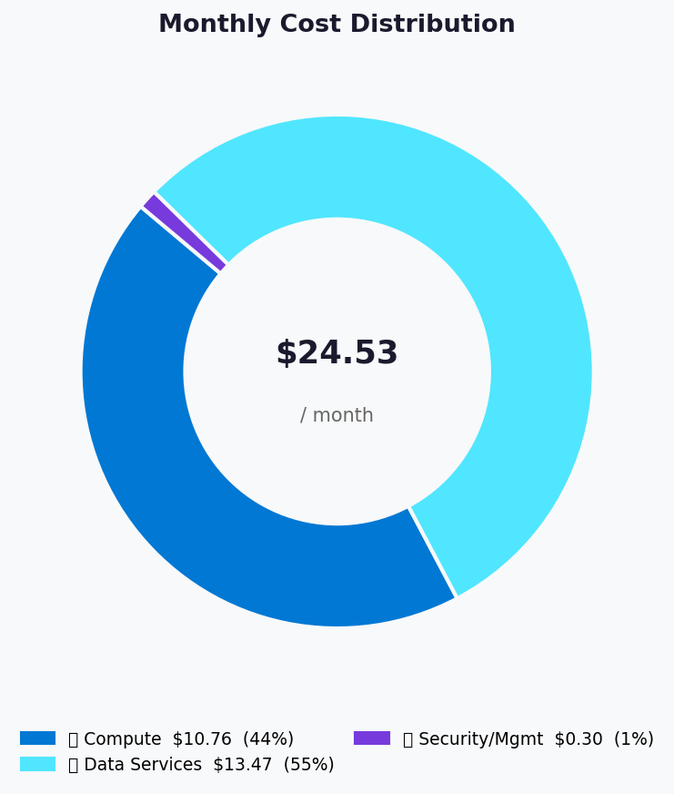
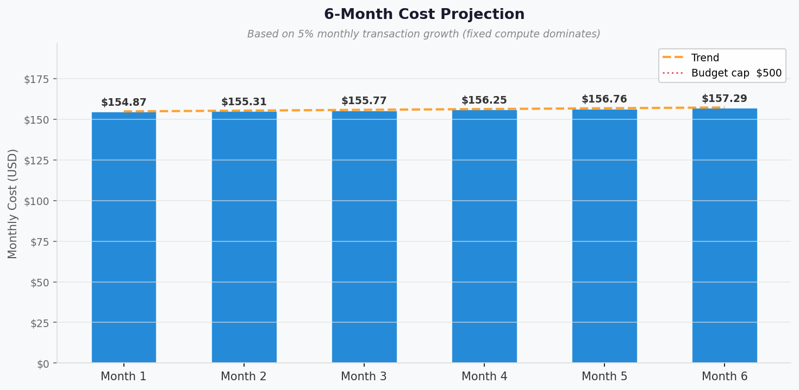

# 💰 Azure Cost Estimate: Malta Catering


<details open>
<summary><strong>📑 Cost Estimate Contents</strong></summary>

- [💵 Cost At-a-Glance](#-cost-at-a-glance)
- [✅ Decision Summary](#-decision-summary)
- [🔁 Requirements → Cost Mapping](#-requirements--cost-mapping)
- [📊 Top 5 Cost Drivers](#-top-5-cost-drivers)
- [🏛️ Architecture Overview](#-architecture-overview)
- [🧾 What We Are Not Paying For (Yet)](#-what-we-are-not-paying-for-yet)
- [⚠️ Cost Risk Indicators](#-cost-risk-indicators)
- [🎯 Quick Decision Matrix](#-quick-decision-matrix)
- [💰 Savings Opportunities](#-savings-opportunities)
- [🧾 Detailed Cost Breakdown](#-detailed-cost-breakdown)
- [References](#references)

</details>

> Generated by architect agent | 2026-04-14

| ⬅️ Previous                                                    | 📑 Index            | Next ➡️                                                      |
| -------------------------------------------------------------- | ------------------- | ------------------------------------------------------------ |
| [02-architecture-assessment.md](02-architecture-assessment.md) | [README](README.md) | [04-governance-constraints.md](04-governance-constraints.md) |

**Generated**: 2026-04-14
**Region**: swedencentral
**Environment**: Development
**MCP Tools Used**: azure_pricing (pricing_get with region/meter filters)
**Architecture Reference**: [02-architecture-assessment.md](02-architecture-assessment.md)

## 💵 Cost At-a-Glance

> **Monthly Total: ~$24.53** | Annual: ~$294.24
>
> ```text
> Budget: EUR 100-500/month (soft) | Utilization: ~5-25% ($24.53 of $100-500)
> ```
>
> | Status            | Indicator                                               |
> | ----------------- | ------------------------------------------------------- |
> | Cost Trend        | ➡️ Stable (consumption-based, scales with usage)        |
> | Savings Available | 💰 Minimal — already near floor with consumption tiers  |
> | Compliance        | ✅ GDPR-aligned (swedencentral, EU-only data residency) |

## ✅ Decision Summary

- ✅ Approved: Container Apps Consumption + ACR Basic + Table Storage LRS + Key Vault Standard
- ⏳ Deferred: CDN/Front Door, private endpoints, CI/CD pipeline, alerting
- 🔁 Redesign Trigger: If traffic exceeds 10K daily users or data > 10 GiB, revisit
  storage tier and Container Apps scaling limits

**Confidence**: Medium | **Expected Variance**: ±15%
(Container Apps free grant meter not confirmed in MCP query; actual cost may be lower)

## 🔁 Requirements → Cost Mapping

| Requirement       | Architecture Decision          | Cost Impact    | Mandatory |
| ----------------- | ------------------------------ | -------------- | --------- |
| 99.0% SLA         | Container Apps Consumption     | +$10.76/month  | Yes       |
| GDPR compliance   | swedencentral region           | +$0/month      | Yes       |
| 1 TPS throughput  | 0.25 vCPU / 0.5 GiB container | +$10.76/month  | Yes       |
| Order persistence | Table Storage (Standard LRS)   | +$8.47/month   | Yes       |
| Secrets management | Key Vault Standard            | +$0.30/month   | Yes       |
| Image management  | ACR Basic                      | +$5.00/month   | Yes       |
| Monitoring        | Log Analytics (free tier)      | +$0.00/month   | No        |

## 📊 Top 5 Cost Drivers

| Rank | Resource             | Monthly Cost | % of Total | Trend | Optimization              |
| ---- | -------------------- | ------------ | ---------- | ----- | ------------------------- |
| 1️⃣   | Container Apps       | $10.76       | 43.9%      | ➡️    | Scale-to-zero overnight   |
| 2️⃣   | Storage Account      | $8.47        | 34.5%      | ➡️    | Minimize write operations |
| 3️⃣   | Container Registry   | $5.00        | 20.4%      | ➡️    | None (fixed Basic unit)   |
| 4️⃣   | Key Vault            | $0.30        | 1.2%       | ➡️    | Cache secrets in app      |
| 5️⃣   | Log Analytics        | $0.00        | 0.0%       | ➡️    | Stay under 5 GiB/month   |

> 💡 **Quick Win**: Ensure Container Apps scales to 0 replicas during overnight
> hours (midnight-8am Malta time) to save ~33% of compute cost.

<details>
<summary><strong>Cost Driver Details</strong></summary>

#### 1️⃣ Container Apps (Compute)

| Aspect            | Detail                                              |
| ----------------- | --------------------------------------------------- |
| Current SKU       | Consumption (0.25 vCPU, 0.5 GiB)                   |
| Monthly Cost      | $10.76                                              |
| Cost Breakdown    | vCPU-seconds: $7.78, Memory-seconds: $1.94, Requests: $1.04 |
| Optimization      | Scale-to-zero overnight; tune vCPU/memory if over-allocated |
| Potential Savings | ~$3-4/month by reducing active hours                |

#### 2️⃣ Storage Account (Table Storage)

| Aspect            | Detail                                            |
| ----------------- | ------------------------------------------------- |
| Current SKU       | Standard LRS GPv2                                 |
| Monthly Cost      | $8.47                                             |
| Cost Breakdown    | Table write ops (2.6M): $8.45, Blob storage: $0.02 |
| Optimization      | Batch write operations to reduce transaction count |
| Potential Savings | ~$2-3/month with batched writes                   |

</details>

## 🏛️ Architecture Overview

### Cost Distribution

| Category            | Monthly Cost (USD) | Share  |
| ------------------- | -----------------: | -----: |
| 💻 Compute          |             $10.76 | 43.9%  |
| 💾 Data Services    |             $13.47 | 54.9%  |
| 🔐 Security/Mgmt    |              $0.30 |  1.2%  |
| 📊 Monitoring       |              $0.00 |  0.0%  |



### Month-over-Month Projection



> Projection assumes stable 1 TPS baseline with 5% monthly growth in
> transactions. No tier changes expected within this growth range.

### Key Design Decisions Affecting Cost

| Decision              | Cost Impact | Business Rationale       | Status   |
| --------------------- | ----------- | ------------------------ | -------- |
| Consumption plan      | -$40/month  | Scale-to-zero saves idle cost | Required |
| LRS over ZRS          | -$2/month   | Single-region dev/demo   | Required |
| ACR Basic over Std    | -$15/month  | Single app, < 10 GiB     | Required |
| No CDN/Front Door     | -$25/month  | < 1K users, demo scope   | Optional |
| No private endpoints  | -$15/month  | Public endpoints accepted | Optional |

## 🧾 What We Are Not Paying For (Yet)

- Multi-region active-active failover
- Private endpoints for Storage and Key Vault (~$7.30/endpoint/mo each)
- Azure Front Door or CDN for static asset delivery (~$25+/month)
- Azure Monitor alerts and action groups
- CI/CD pipeline (GitHub Actions free tier covers it)
- WAF or DDoS Standard protection

### Assumptions & Uncertainty

- Container Apps scales to zero overnight (12h active, 12h idle)
- Table Storage write operations at ~2.6M/month (1 TPS × 30 days)
- Log Analytics ingestion stays under 5 GiB/month (free tier)
- Container Apps free grant may reduce actual cost further (not confirmed)

## ⚠️ Cost Risk Indicators

| Resource        | Risk Level | Issue                        | Mitigation                    |
| --------------- | ---------- | ---------------------------- | ----------------------------- |
| Container Apps  | 🟢 Low     | Unexpected traffic spike     | Consumption auto-scales; cost scales linearly |
| Storage Account | 🟢 Low     | Write-heavy patterns inflate cost | Batch operations; monitor transaction count |
| Log Analytics   | 🟡 Medium  | Verbose logging exceeds 5 GiB | Configure log levels; set daily cap |

> **⚠️ Watch Item**: Log Analytics ingestion — if container app logs are verbose,
> ingestion may exceed the 5 GiB free tier, adding ~$2.76/GiB.

## 🎯 Quick Decision Matrix

_"If you need X, expect to pay Y more"_

| Requirement           | Additional Cost | SKU Change           | Verdict     | Notes                  |
| --------------------- | --------------- | -------------------- | ----------- | ---------------------- |
| 99.9% SLA             | +$0/month       | Already covered      | 🟢 Go       | Container Apps: 99.95% |
| Private Endpoints     | +$14.60/month   | Add PE for KV + ST   | 🟡 Monitor  | Defer until production |
| CDN for static assets | +$25/month      | Add Azure CDN        | 🟡 Monitor  | Defer until > 1K users |
| Multi-region failover | +$30-50/month   | Add GRS + second env | 🔴 Investigate | Not needed for demo  |
| Automated backups     | +$5-10/month    | Add Azure Function   | 🟡 Monitor  | Address REQ-001 in prod |

## 💰 Savings Opportunities

> ### Savings: Not Applicable
>
> This design uses consumption-based pricing exclusively. Commitment
> discounts (RI/SP) do not apply to the selected service tiers.
> All services are either pay-per-use (Container Apps, Key Vault,
> Table Storage operations) or fixed at the minimum tier (ACR Basic).

## 🧾 Detailed Cost Breakdown

### Assumptions

- Hours: 730 hours/month (12h active × 30 days for compute estimates)
- Network egress: negligible (< 1 GiB/month, within free tier)
- Storage growth: < 1 GiB in month 1, growing to ~1 GiB over 12 months

### Line Items

| Category            | Service          | SKU / Meter                     | Quantity / Units           | Est. Monthly |
| ------------------- | ---------------- | ------------------------------- | -------------------------- | -----------: |
| 💻 Compute          | Container Apps   | vCPU Active Usage               | 324K vCPU-sec (0.25 vCPU × 12h × 30d) | $7.78 |
| 💻 Compute          | Container Apps   | Memory Active Usage             | 648K GiB-sec (0.5 GiB × 12h × 30d) | $1.94 |
| 💻 Compute          | Container Apps   | Requests                        | 2.592M requests/month      | $1.04        |
| 💾 Data Services    | Container Registry | Basic Registry Unit           | 30 days                    | $5.00        |
| 💾 Data Services    | Storage Account  | Table LRS Write Ops             | 260 × 10K ops (2.6M/month) | $8.45       |
| 💾 Data Services    | Storage Account  | Hot LRS Data Stored (Blob)      | 1 GiB-month                | $0.02        |
| 🔐 Security/Mgmt    | Key Vault        | Standard Operations             | 10 × 10K ops (100K/month)  | $0.30        |
| 📊 Monitoring       | Log Analytics    | Data Ingestion (free tier)      | 1 GiB/month (< 5 GiB free) | $0.00       |
| **Total**           |                  |                                 |                            | **$24.53**   |

### Notes

- All prices sourced from Azure Pricing MCP (`pricing_get` with swedencentral filters)
- Container Apps free grant (first 180K vCPU-sec, 360K GiB-sec/month) may reduce
  actual compute cost to near-zero; not confirmed in MCP response
- No reservation eligibility — all services are consumption/per-operation
- Dev/Test pricing not separately available for these service tiers

---

## References

| Topic                    | Link                                                                                                                   |
| ------------------------ | ---------------------------------------------------------------------------------------------------------------------- |
| Azure Pricing Calculator | [Calculator](https://azure.microsoft.com/pricing/calculator/)                                                          |
| Container Apps Pricing   | [Pricing](https://azure.microsoft.com/pricing/details/container-apps/)                                                 |
| Storage Pricing          | [Pricing](https://azure.microsoft.com/pricing/details/storage/tables/)                                                 |
| Key Vault Pricing        | [Pricing](https://azure.microsoft.com/pricing/details/key-vault/)                                                      |
| Cost Management          | [Overview](https://learn.microsoft.com/azure/cost-management-billing/costs/overview-cost-management)                   |
| WAF Cost Optimization    | [Checklist](https://learn.microsoft.com/azure/well-architected/cost-optimization/checklist)                            |

---

<div align="center">

| ⬅️ [02-architecture-assessment.md](02-architecture-assessment.md) | 🏠 [Project Index](README.md) | ➡️ [04-governance-constraints.md](04-governance-constraints.md) |
| ----------------------------------------------------------------- | ----------------------------- | --------------------------------------------------------------- |

</div>
