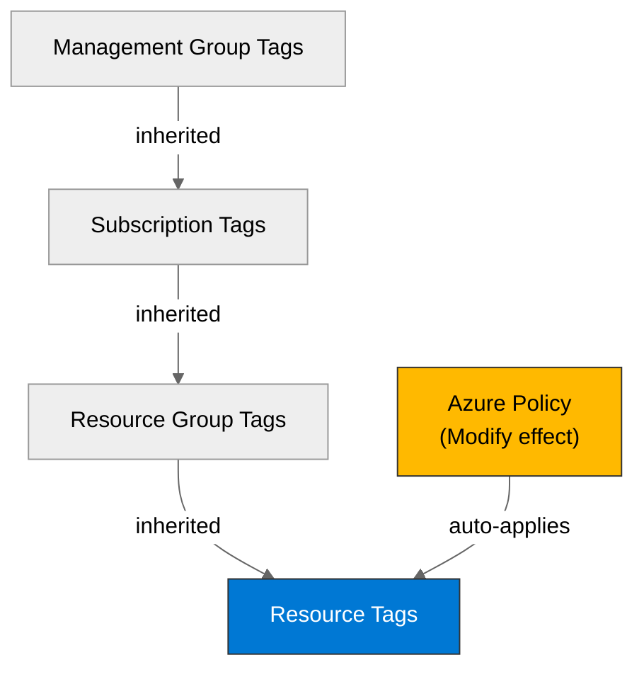

# 🛡️ Governance Constraints - malta-catering


<details open>
<summary><strong>📑 Governance Contents</strong></summary>

- [🔍 Discovery Source](#-discovery-source)
- [📋 Azure Policy Compliance](#-azure-policy-compliance)
- [🔄 Plan Adaptations Based on Policies](#-plan-adaptations-based-on-policies)
- [🚫 Deployment Blockers](#-deployment-blockers)
- [🏷️ Required Tags](#-required-tags)
- [🔐 Security Policies](#-security-policies)
- [💰 Cost Policies](#-cost-policies)
- [🌐 Network Policies](#-network-policies)
- [References](#references)

</details>

> Generated by governance agent | 2026-04-14

| ⬅️ Previous                                        | 📑 Index            | Next ➡️                                                |
| -------------------------------------------------- | ------------------- | ------------------------------------------------------ |
| [03-des-cost-estimate.md](03-des-cost-estimate.md) | [README](README.md) | [04-implementation-plan.md](04-implementation-plan.md) |

This document captures the governance constraints and Azure Policy requirements
that must be addressed before the Bicep implementation is generated. Assignment
coverage is live REST-verified, and Azure Portal count validation remains a
follow-up check rather than part of this pass.

## 🔍 Discovery Source

> [!IMPORTANT]
> Governance constraints were discovered from the live Azure environment and not assumed.

| Query              | Results                       | Timestamp             |
| ------------------ | ----------------------------- | --------------------- |
| REST API Total     | 21 assignments total          | 2026-04-14T14:03:53Z |
| Subscription-scope | 5 direct assignments          | 2026-04-14T14:03:53Z |
| MG-inherited       | 9 inherited assignments       | 2026-04-14T14:03:53Z |
| Resource-group     | 7 RG-scoped assignments       | 2026-04-14T14:03:53Z |
| Deny-effect        | 1 true blocker found          | 2026-04-14T14:03:53Z |
| Tag Policies       | 9 required RG tags discovered | 2026-04-14T14:03:53Z |
| Security Policies  | 10 relevant constraints       | 2026-04-14T14:03:53Z |

**Discovery Method**: Azure Policy MCP (`policy_assignment_list`) plus direct ARM REST (`az rest`) for assignment, policy definition, and initiative `policyRule` inspection
**Subscription**: `noalz` (`00858ffc-dded-4f0f-8bbf-e17fff0d47d9`)
**Tenant**: `2d04cb4c-999b-4e60-a3a7-e8993edc768b`
**Scope**: Full subscription, including management-group-inherited assignments
**Portal Validation**: Not performed in this session; assignment coverage is REST-verified but was not cross-checked in Azure Portal

> [!WARNING]
> The dedicated `governance-discovery-subagent` was unavailable because of repeated network `GOAWAY` failures, so live discovery was completed with direct Azure REST calls instead of the subagent. Policy data below remains live and verified.

### Policy Definition Analysis

> [!IMPORTANT]
> **MANDATORY**: Deny and DeployIfNotExists policies were verified against their live `policyRule` JSON to avoid false positives from policy display names.

| Policy Display Name | Assignment Scope | Effect | Actually Blocks | Evidence from policyRule.if | Bicep Property Path | Required Value |
| ------------------- | ---------------- | ------ | --------------- | --------------------------- | ------------------- | -------------- |
| JV-Enforce Resource Group Tags v3 | Management Group | Deny | Resource group creation when any required tag is missing | `field: "type" = "Microsoft.Resources/subscriptions/resourceGroups"` and `anyOf` missing `environment`, `owner`, `costcenter`, `application`, `workload`, `sla`, `backup-policy`, `maint-window`, `technical-contact` | `tags` | Include all 9 required RG tags |
| Block Azure RM Resource Creation | Management Group | Deny | Classic resource types only; does not block Container Apps, Storage, Key Vault, ACR, Log Analytics, or App Insights | `anyOf` checks only `Microsoft.ClassicCompute/*`, `Microsoft.ClassicNetwork/*`, `Microsoft.ClassicStorage/*`, and `Microsoft.MarketplaceApps/classicDevServices` | `N/A` | `N/A` |
| Not allowed resource types | Management Group | Deny | Classical resource types only in the active deny initiative; no modern app/data services used by this design were present | Initiative parameter `listOfResourceTypesNotAllowed` contains only classic resource types | `N/A` | `N/A` |
| Deny Azure Key Vault Managed HSM with Purge Protection Enabled | Management Group | Deny | `Microsoft.KeyVault/managedHSMs` only; does not apply to `Microsoft.KeyVault/vaults` | `field: "type" = "Microsoft.KeyVault/managedHSMs"` and `enablePurgeProtection = true` | `N/A` | `N/A` |
| Deploy Resource Group McapsGovernance | Management Group | DeployIfNotExists | Auto-creates a support resource group for governance resources | `field: "type" = "Microsoft.Resources/Subscriptions"`; deployment creates RG `McapsGovernance` in `WestUS2` | `N/A` | RG `McapsGovernance` exists |
| Deploy Storage Account for Diagnostic Settings | Management Group | DeployIfNotExists | Auto-creates a governance-managed diagnostics storage account | `field: "type" = "Microsoft.Resources/subscriptions"`; deployment creates StorageV2 with `allowBlobPublicAccess=false`, `allowSharedKeyAccess=false`, `minimumTlsVersion="TLS1_2"`, `publicNetworkAccess="Disabled"` | `N/A` | Support storage account exists |

**Analysis Notes**:

- The only true deny blocker for this architecture is the **resource-group tag policy**.
- Public endpoint concerns for Storage and Key Vault are currently **audit / modify**, not deny, in the active subscription scope.
- The deny initiative contains no direct Container Apps, ACR, Key Vault vault, or Storage Account deny policy for modern resource types.
- A governance inconsistency exists: the resource-group deny policy requires `technical-contact`, but the tag inheritance modify policy uses `tech-contact` for child resources.

## 📋 Azure Policy Compliance

| Category       | Constraint | Implementation | Status |
| -------------- | ---------- | -------------- | ------ |
| Naming         | No active deny policy for CAF naming was discovered for this architecture | Use normal CAF-style names in Bicep | ✅ |
| Tagging        | Resource groups must include 9 exact tags; child resources are auto-modified to inherit 9 tags | Pre-create or deploy into a compliant RG and define both `technical-contact` and `tech-contact` to bridge policy drift | ❌ |
| Security       | Storage settings are auto-hardened; Key Vault RBAC / firewall / private link are audit-only controls | Set storage hardening explicitly and keep Key Vault warnings visible in plan | ⚠️ |
| Data Residency | No deny on `swedencentral` was discovered in active assignments | Keep all app resources in `swedencentral`; note governance support resources auto-deploy in `WestUS2` | ✅ |

> [!WARNING]
> The design is **not deployable into a newly created resource group** until the required tag set is satisfied.

## 🔄 Plan Adaptations Based on Policies

> [!NOTE]
> This section documents how the implementation plan must adapt to comply with the discovered Azure Policies.

### Architectural Changes

| Original Design | Blocking Policy | Effect | Adaptation Applied |
| --------------- | --------------- | ------ | ------------------ |
| Default 4-tag model (`Environment`, `ManagedBy`, `Project`, `Owner`) | JV-Enforce Resource Group Tags v3 | Deny | Expand the deployment contract to 9 governance tags on the resource group: `environment`, `owner`, `costcenter`, `application`, `workload`, `sla`, `backup-policy`, `maint-window`, `technical-contact` |
| Resource tags assumed to be passed directly from IaC only | JV - Inherit Multiple Tags from Resource Group | Modify | Keep explicit tags in Bicep anyway to avoid drift and to make compliance visible in code reviews |
| Storage account defaults left to platform | StorageAccount_BlobAnonymousAccess_Modify + StorageAccount_DisableLocalAuth_Modify | Modify | Set `allowBlobPublicAccess: false` and `allowSharedKeyAccess: false` explicitly in IaC |
| Public Key Vault and relaxed Storage network posture were treated as provisional architecture decisions | Azure Security Baseline built-ins | Audit / AuditIfNotExists | Keep network posture provisional; private link, Key Vault firewall/public-network restriction, and Storage network ACLs are warnings rather than deny controls in the discovered scope |

### Auto-Applied Resources

| Policy | Effect | Auto-Applied Resource |
| ------ | ------ | --------------------- |
| Deploy Resource Group McapsGovernance | DeployIfNotExists | May auto-create resource group `McapsGovernance` in `WestUS2` |
| Deploy Storage Account for Diagnostic Settings | DeployIfNotExists | May auto-create a governance-managed StorageV2 account in `McapsGovernance` with TLS 1.2, HTTPS-only, no blob public access, no shared key access, and `publicNetworkAccess = Disabled` |

### Auto-Modified Configurations

| Policy | Effect | Auto-Applied Change |
| ------ | ------ | ------------------- |
| JV - Inherit Multiple Tags from Resource Group | Modify | Adds or replaces 9 child-resource tags from the resource-group tag set |
| Ensure secure access to storage account containers | Modify | Forces `allowBlobPublicAccess = false` unless excluded with `SecurityControl = Ignore` |
| SFI-ID4.2.1 Storage Accounts - Safe Secrets Standard | Modify | Forces `allowSharedKeyAccess = false` unless excluded with `SecurityControl = Ignore` |

## 🚫 Deployment Blockers

> [!CAUTION]
> **CRITICAL**: This section lists policies that block deployment. Resolution is required before proceeding to code generation.

### JV-Enforce Resource Group Tags v3

- **Policy ID**: `/providers/Microsoft.Management/managementGroups/2d04cb4c-999b-4e60-a3a7-e8993edc768b/providers/Microsoft.Authorization/policyDefinitions/27833bcf-5909-4a37-891c-16a3cb06856d`
- **Effect**: Deny
- **Scope**: Management group `2d04cb4c-999b-4e60-a3a7-e8993edc768b`
- **Enforcement Mode**: Default
- **Impact**: New resource groups are denied unless all 9 required tags exist: `environment`, `owner`, `costcenter`, `application`, `workload`, `sla`, `backup-policy`, `maint-window`, `technical-contact`
- **Assessment Date**: 2026-04-14

**Resolution Options**:

1. **Request Policy Exemption**:
   - **Justification**: Demo workload with short lifetime and limited blast radius
   - **Duration**: Temporary
   - **Risk Level**: Medium
   - **Approval Process**: Governance owner approves a management-group exemption scoped to the target resource group

2. **Alternative Architecture**:
   - Deploy into an existing compliant resource group or ensure the resource group is created with all 9 required tags before app resources are provisioned
   - **Trade-offs**: Slightly more deployment orchestration; no architecture redesign required

**Status**: ⚠️ **DEPLOYMENT CANNOT PROCEED WITHOUT RESOURCE-GROUP TAG COMPLIANCE**

**Next Steps**:

- [ ] Confirm whether the target resource group already exists with the required 9 tags
- [ ] Or extend the deployment process so the resource group is created/tagged before Bicep provisions app resources
- [ ] Or secure a temporary exemption

## 🏷️ Required Tags

Resource-group deny policy requires these exact tag keys:

- `environment`
- `owner`
- `costcenter`
- `application`
- `workload`
- `sla`
- `backup-policy`
- `maint-window`
- `technical-contact`

Child-resource modify policy inherits these exact tag keys from the resource group:

- `environment`
- `owner`
- `costcenter`
- `application`
- `workload`
- `sla`
- `backup-policy`
- `maint-window`
- `tech-contact`

> [!WARNING]
> Governance currently has a tag-key mismatch: the deny policy requires `technical-contact`, but the modify policy inherits `tech-contact`. Until governance owners correct the drift, define **both** keys in the deployment contract.

```bicep
tags: {
  environment: environment
  owner: owner
  costcenter: costCenter
  application: projectName
  workload: 'ordering-portal'
  sla: 'bronze-demo'
  'backup-policy': 'none-demo'
  'maint-window': 'sun-0200-0400'
  'technical-contact': technicalContact
  'tech-contact': technicalContact
}
```



## 🔐 Security Policies

| Policy | Requirement |
| ------ | ----------- |
| HTTPS Only | Storage accounts are audited for `supportsHttpsTrafficOnly`; set it explicitly to `true` even though no deny was discovered |
| TLS Version | Governance-created diagnostics storage forces `minimumTlsVersion = TLS1_2`; no direct Container Apps TLS deny was discovered |
| Public Access | Storage blob public access is auto-modified to `false`; Key Vault firewall / public network controls and Storage network ACL restrictions are audit-only in the current scope |
| Managed Identity | No direct deny for Container Apps managed identity was discovered; Storage shared key access is auto-modified off |
| Key Vault | Key Vault is audited for RBAC mode, firewall/public network restriction, private link, purge protection, soft delete, and diagnostic logs |

## 💰 Cost Policies

| Policy | Constraint |
| ------ | ---------- |
| Budget | No Azure Policy budget cap or spend-deny policy was discovered in the active subscription scope |
| SKU Restrictions | Active deny controls target VM SKUs, AKS node counts, OpenAI provisioned capacity, and Sentinel commitment tiers; none target Container Apps, ACR Basic, Storage, or Key Vault |
| Reserved Capacity | No reserved-capacity governance control was discovered for this architecture |
| Governance Support Resources | DeployIfNotExists policies may create `McapsGovernance` and a locked-down diagnostics storage account in `WestUS2`, which introduces small background cost outside the app architecture |

## 🌐 Network Policies

| Policy | Constraint |
| ------ | ---------- |
| Private Endpoints | Storage and Key Vault private-link controls exist, but the active effects are audit / audit-if-not-exists rather than deny |
| VNet Integration | No active deny policy requiring Container Apps VNet integration was discovered |
| Public Endpoints | No direct deny against Container Apps public ingress was discovered; Key Vault firewall/public-network and Storage `networkAcls.defaultAction` controls remain warnings only |

---

## References

| Topic | Link |
| ----- | ---- |
| Azure Policy | [Overview](https://learn.microsoft.com/azure/governance/policy/overview) |
| Azure Policy Assignments REST | [Policy Assignments - Get / List](https://learn.microsoft.com/rest/api/policy/policy-assignments) |
| Azure Policy Definitions REST | [Policy Definitions](https://learn.microsoft.com/rest/api/policy/policy-definitions) |
| Azure Policy Set Definitions REST | [Policy Set Definitions](https://learn.microsoft.com/rest/api/policy/policy-set-definitions) |
| Azure Resource Graph | [ARG Overview](https://learn.microsoft.com/azure/governance/resource-graph/overview) |
| Tag Governance | [Tagging Strategy](https://learn.microsoft.com/azure/cloud-adoption-framework/ready/azure-best-practices/resource-tagging) |

---

_Governance constraints discovered from the live Azure Policy environment._
_No best-practice fallback policies were invented._

---

<div align="center">

| ⬅️ [03-des-cost-estimate.md](03-des-cost-estimate.md) | 🏠 [Project Index](README.md) | ➡️ [04-implementation-plan.md](04-implementation-plan.md) |
| ----------------------------------------------------- | ----------------------------- | --------------------------------------------------------- |

</div>
