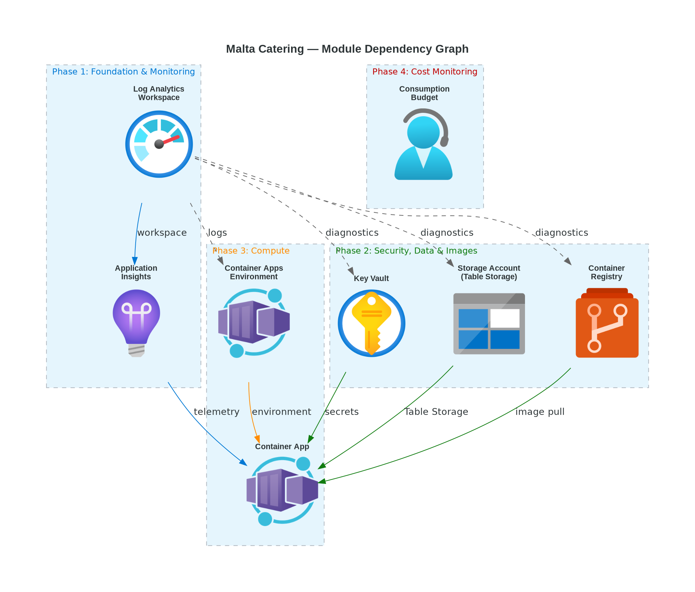
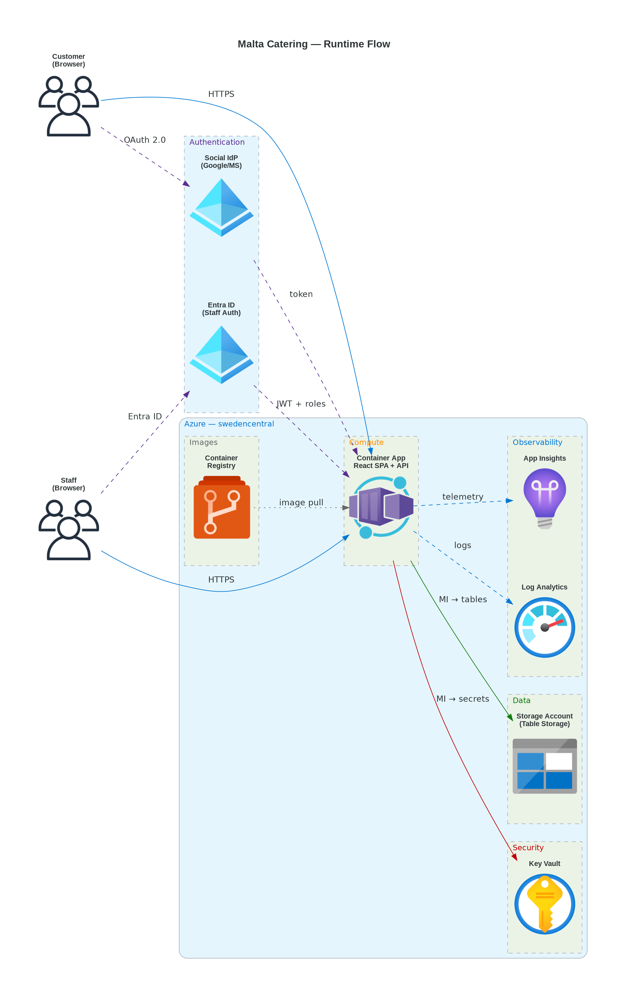

# 📀 Step 4: Implementation Plan - Malta Catering


<details open>
<summary><strong>📑 Implementation Contents</strong></summary>

- [📋 Overview](#-overview)
- [📦 Resource Inventory](#-resource-inventory)
- [🗂️ Module Structure](#-module-structure)
- [🔨 Implementation Tasks](#-implementation-tasks)
- [🚀 Deployment Phases](#-deployment-phases)
- [🔗 Dependency Graph](#-dependency-graph)
- [🔄 Runtime Flow Diagram](#-runtime-flow-diagram)
- [🏷️ Naming Conventions](#-naming-conventions)
- [🔐 Security Configuration](#-security-configuration)
- [⏱️ Estimated Implementation Time](#-estimated-implementation-time)
- [🔒 Approval Gate](#-approval-gate)
- [References](#references)

</details>

> Generated by IaC Planner agent | 2026-04-14

| ⬅️ Previous                                                  | 📑 Index            | Next ➡️                                        |
| ------------------------------------------------------------ | ------------------- | ---------------------------------------------- |
| [04-governance-constraints.md](04-governance-constraints.md) | [README](README.md) | [04-preflight-check.md](04-preflight-check.md) |

## 📋 Overview

Bicep implementation plan for the Malta Catering ordering portal — a lightweight SPA + API
on Azure Container Apps (Consumption) backed by Table Storage, Key Vault, and a full
observability stack. All 7 architecture resources plus a cost-monitoring budget are
covered by AVM modules or native Bicep resources. Deployment uses a **4-phase** strategy
with dependency-ordered sequencing and validation gates between phases.

**Governance adaptation**: The resource group must carry 9 tags enforced by a
management-group-level Deny policy (`JV-Enforce Resource Group Tags v3`). The
deployment contract expands beyond the default 4-tag model accordingly. Storage
and Key Vault network hardening are audit-only warnings in the current scope
and are set explicitly in IaC for visibility.

---

## 📦 Resource Inventory

| Resource                   | Type                                            | SKU              | AVM Module                                                   | Version    | Dependencies                                  | Status  |
| -------------------------- | ----------------------------------------------- | ---------------- | ------------------------------------------------------------ | ---------- | --------------------------------------------- | ------- |
| Log Analytics Workspace    | `Microsoft.OperationalInsights/workspaces`       | Per-GB (free)    | ✅ `br/public:avm/res/operational-insights/workspace`         | `0.15.0`   | —                                              | ⬜ Todo |
| Application Insights       | `Microsoft.Insights/components`                  | Free tier        | ✅ `br/public:avm/res/insights/component`                     | `0.7.1`    | Log Analytics                                 | ⬜ Todo |
| Key Vault                  | `Microsoft.KeyVault/vaults`                      | Standard         | ✅ `br/public:avm/res/key-vault/vault`                        | `0.13.3`   | Log Analytics                                 | ⬜ Todo |
| Storage Account            | `Microsoft.Storage/storageAccounts`              | Standard LRS GPv2| ✅ `br/public:avm/res/storage/storage-account`                | `0.32.0`   | Log Analytics                                 | ⬜ Todo |
| Container Registry         | `Microsoft.ContainerRegistry/registries`         | Basic            | ✅ `br/public:avm/res/container-registry/registry`            | `0.12.1`   | Log Analytics                                 | ⬜ Todo |
| Container Apps Environment | `Microsoft.App/managedEnvironments`              | Consumption      | ✅ `br/public:avm/res/app/managed-environment`                | `0.13.1`   | Log Analytics                                 | ⬜ Todo |
| Container App              | `Microsoft.App/containerApps`                    | 0.25 vCPU/0.5 GiB| ✅ `br/public:avm/res/app/container-app`                      | `0.22.0`   | CA Env, ACR, KV, Storage, App Insights        | ⬜ Todo |
| Consumption Budget         | `Microsoft.Consumption/budgets`                  | —                | ❌ Native (AVM is MG-scoped only)                             | `2023-11-01`| —                                             | ⬜ Todo |

> **AVM coverage**: 7/8 resources use AVM modules. Budget uses a native Bicep resource because
> the AVM budget module (`avm/res/consumption/budget/mg-scope`) targets management-group scope,
> not resource-group scope.

---

## 🗂️ Module Structure

```text
infra/bicep/malta-catering/
├── main.bicep                          # Orchestration — phased module calls
├── main.bicepparam                     # Parameter file (.bicepparam format)
├── modules/
│   ├── log-analytics.bicep             # AVM: operational-insights/workspace
│   ├── app-insights.bicep              # AVM: insights/component
│   ├── key-vault.bicep                 # AVM: key-vault/vault
│   ├── storage.bicep                   # AVM: storage/storage-account
│   ├── container-registry.bicep        # AVM: container-registry/registry
│   ├── container-apps-env.bicep        # AVM: app/managed-environment
│   ├── container-app.bicep             # AVM: app/container-app
│   └── budget.bicep                    # Native: Microsoft.Consumption/budgets
└── deploy.ps1                          # Deployment script with what-if
```

| Module                     | AVM Source                                                      | Version    | Purpose                                     |
| -------------------------- | --------------------------------------------------------------- | ---------- | ------------------------------------------- |
| log-analytics.bicep        | `br/public:avm/res/operational-insights/workspace`              | `0.15.0`   | Shared log sink for all resources            |
| app-insights.bicep         | `br/public:avm/res/insights/component`                          | `0.7.1`    | Application-level telemetry                  |
| key-vault.bicep            | `br/public:avm/res/key-vault/vault`                             | `0.13.3`   | Secrets management with RBAC auth            |
| storage.bicep              | `br/public:avm/res/storage/storage-account`                     | `0.32.0`   | Table Storage for orders and menu data       |
| container-registry.bicep   | `br/public:avm/res/container-registry/registry`                 | `0.12.1`   | Basic-tier image registry                    |
| container-apps-env.bicep   | `br/public:avm/res/app/managed-environment`                     | `0.13.1`   | Consumption-plan environment                 |
| container-app.bicep        | `br/public:avm/res/app/container-app`                           | `0.22.0`   | React SPA + API with managed identity        |
| budget.bicep               | Native `Microsoft.Consumption/budgets@2023-11-01`               | —          | Cost monitoring with forecast alerts         |

---

## 🔨 Implementation Tasks

### Task 1: main.bicep (Orchestration)

**Purpose**: Top-level entry point. Generates the unique suffix, defines shared parameters, and calls all modules in dependency order.

**Parameters**:

- `location` (string, default: `'swedencentral'`)
- `environment` (string, default: `'dev'`)
- `project` (string, default: `'malta-catering'`)
- `owner` (string) — tag value for governance
- `costcenter` (string) — tag value for governance
- `application` (string, default: `'malta-catering'`)
- `workload` (string, default: `'ordering-portal'`)
- `sla` (string, default: `'99.0'`)
- `backupPolicy` (string, default: `'none-demo'`)
- `maintWindow` (string, default: `'sun-02-06'`)
- `technicalContact` (string) — email for governance tag
- `budgetAmount` (int, default: `500`) — monthly EUR
- `budgetContactEmails` (array) — cost alert recipients
- `budgetStartDate` (string) — `YYYY-MM-01` format
- `containerImageName` (string, default: `'malta-catering-app'`)
- `containerImageTag` (string, default: `'latest'`)

**Variables**:

- `uniqueSuffix = uniqueString(resourceGroup().id)` — generated once, passed to all modules
- `tags` — object with all 9 governance-required tags plus `ManagedBy: 'Bicep'`

**Modules Called** (in order):

1. `log-analytics.bicep`
2. `app-insights.bicep` ← depends on Log Analytics output
3. `key-vault.bicep` ← depends on Log Analytics output
4. `storage.bicep` ← depends on Log Analytics output
5. `container-registry.bicep` ← depends on Log Analytics output
6. `container-apps-env.bicep` ← depends on Log Analytics output
7. `container-app.bicep` ← depends on CA Env, ACR, KV, Storage, App Insights outputs
8. `budget.bicep` ← standalone

### Task 2: modules/log-analytics.bicep

**Resources** (via AVM):

- Log Analytics Workspace: `log-malta-catering-dev`, Per-GB tier, 30-day retention

**Key Configuration**:

```yaml
sku: PerGB2018
retentionInDays: 30
dailyQuotaGb: 5      # free-tier cap
```

**Outputs**: `resourceId`, `resourceName`

### Task 3: modules/app-insights.bicep

**Resources** (via AVM):

- Application Insights: `appi-malta-catering-dev`, linked to Log Analytics workspace

**Key Configuration**:

```yaml
kind: web
applicationType: web
workspaceResourceId: <logAnalytics.outputs.resourceId>
```

**Outputs**: `resourceId`, `connectionString`, `instrumentationKey`

### Task 4: modules/key-vault.bicep

**Resources** (via AVM):

- Key Vault: `kv-malta-dev-{suffix}` (24-char limit)
- RBAC authorization enabled, purge protection on
- Diagnostic settings to Log Analytics

**Key Configuration**:

```yaml
enableRbacAuthorization: true
enablePurgeProtection: true
enableSoftDelete: true
softDeleteRetentionInDays: 7
diagnosticSettings:
  - workspaceResourceId: <logAnalytics.outputs.resourceId>
    categoryGroup: allLogs
    metrics: AllMetrics
```

**Outputs**: `resourceId`, `resourceName`, `uri`

### Task 5: modules/storage.bicep

**Resources** (via AVM):

- Storage Account: `stmaltadev{suffix}` (24-char limit, no hyphens)
- Table service enabled for orders and menu entities
- Governance hardening applied explicitly

**Key Configuration**:

```yaml
kind: StorageV2
sku: Standard_LRS
minimumTlsVersion: TLS1_2
supportsHttpsTrafficOnly: true
allowBlobPublicAccess: false
allowSharedKeyAccess: false        # Entra ID auth only (governance Modify policy)
tableServices:
  tables:
    - name: orders
    - name: menu
    - name: customers
diagnosticSettings:
  - workspaceResourceId: <logAnalytics.outputs.resourceId>
```

**Outputs**: `resourceId`, `resourceName`, `primaryEndpoints`

### Task 6: modules/container-registry.bicep

**Resources** (via AVM):

- Container Registry: `acrmaltadev{suffix}` (no hyphens)
- Basic SKU, admin user disabled

**Key Configuration**:

```yaml
sku: Basic
adminUserEnabled: false
diagnosticSettings:
  - workspaceResourceId: <logAnalytics.outputs.resourceId>
```

**Outputs**: `resourceId`, `resourceName`, `loginServer`

### Task 7: modules/container-apps-env.bicep

**Resources** (via AVM):

- Container Apps Environment: `cae-malta-catering-dev`
- Consumption plan, Log Analytics integration

**Key Configuration**:

```yaml
appLogsConfiguration:
  destination: log-analytics
  logAnalyticsConfiguration:
    customerId: <logAnalytics.outputs.customerId>
    sharedKey: <logAnalytics listKeys>
zoneRedundant: false                # single zone for dev/demo
```

**Outputs**: `resourceId`, `resourceName`, `defaultDomain`

### Task 8: modules/container-app.bicep

**Resources** (via AVM):

- Container App: `ca-malta-catering-dev`
- System-assigned managed identity
- HTTP ingress on port 80, external
- 0–1 replicas (scale-to-zero)
- Role assignments: KV Secrets User, Storage Table Data Contributor, ACR Pull

**Key Configuration**:

```yaml
managedIdentities:
  systemAssigned: true
containers:
  - name: malta-catering-app
    image: <acr.loginServer>/<imageName>:<imageTag>
    resources:
      cpu: 0.25
      memory: 0.5Gi
    env:
      - name: APPLICATIONINSIGHTS_CONNECTION_STRING
        secretRef: appinsights-conn
      - name: AZURE_STORAGE_ACCOUNT_NAME
        value: <storage.resourceName>
      - name: AZURE_KEYVAULT_URI
        value: <keyVault.uri>
ingress:
  external: true
  targetPort: 80
  transport: http
scale:
  minReplicas: 0
  maxReplicas: 1
roleAssignments:
  - roleDefinitionId: Key Vault Secrets User (4633458b-17de-408a-b874-0445c86b69e6)
    principalType: ServicePrincipal
    scope: keyVault
  - roleDefinitionId: Storage Table Data Contributor (0a9a7e1f-b9d0-4cc4-a60d-0319b160aaa3)
    principalType: ServicePrincipal
    scope: storageAccount
  - roleDefinitionId: AcrPull (7f951dda-4ed3-4680-a7ca-43fe172d538d)
    principalType: ServicePrincipal
    scope: containerRegistry
```

**Outputs**: `resourceId`, `resourceName`, `fqdn`, `principalId`

### Task 9: modules/budget.bicep

**Resources** (native Bicep):

- Consumption Budget: `budget-malta-catering-dev`
- Monthly time grain, 3 forecast alert thresholds

**Key Configuration**:

```yaml
category: Cost
amount: <budgetAmount>           # parameterized, default 500
timeGrain: Monthly
notifications:
  forecast80:
    threshold: 80
    thresholdType: Forecasted
    contactEmails: <budgetContactEmails>
  actual100:
    threshold: 100
    thresholdType: Actual
    contactEmails: <budgetContactEmails>
  forecast120:
    threshold: 120
    thresholdType: Forecasted
    contactEmails: <budgetContactEmails>
```

**Outputs**: `budgetId`, `budgetName`

### Task 10: deploy.ps1 (Deployment Script)

**Features**:

- Parameter validation (required: `owner`, `costcenter`, `technicalContact`, `budgetContactEmails`)
- Bicep lint and build pre-check
- `az deployment group what-if` preview before execution
- Interactive approval gate before actual deployment
- Post-deployment output display (FQDN, resource IDs)

---

## 🚀 Deployment Phases

> Deployment strategy: **Phased** (chosen during planning) — 4 phases with validation gates

### Phase 1: Foundation & Monitoring

| Order | Module              | Resources                               | Validation                             |
| ----- | ------------------- | --------------------------------------- | -------------------------------------- |
| 1     | log-analytics.bicep | Log Analytics Workspace                 | Workspace accessible, data ingesting   |
| 2     | app-insights.bicep  | Application Insights                    | Connected to Log Analytics workspace   |

**Approval Gate**: Verify Log Analytics workspace is provisioned and App Insights is linked.

### Phase 2: Security, Data & Images

| Order | Module                    | Resources                                | Validation                                      |
| ----- | ------------------------- | ---------------------------------------- | ----------------------------------------------- |
| 3     | key-vault.bicep           | Key Vault (Standard, RBAC auth)          | RBAC enabled, diagnostic settings active         |
| 4     | storage.bicep             | Storage Account (LRS GPv2) + 3 tables    | HTTPS-only, no public blob, no shared key, tables exist |
| 5     | container-registry.bicep  | Container Registry (Basic)               | Admin disabled, login server reachable           |

**Approval Gate**: Verify security hardening on KV and Storage. Confirm ACR accepts image push.

### Phase 3: Compute

| Order | Module                     | Resources                                     | Validation                                       |
| ----- | -------------------------- | --------------------------------------------- | ------------------------------------------------ |
| 6     | container-apps-env.bicep   | Container Apps Environment (Consumption)       | Environment provisioned, Log Analytics streaming  |
| 7     | container-app.bicep        | Container App + MI + role assignments          | App deployed, MI has KV/Storage/ACR roles, FQDN responds |

**Approval Gate**: Verify Container App is running, managed identity roles are assigned, FQDN returns HTTP 200.

### Phase 4: Cost Monitoring

| Order | Module       | Resources                              | Validation                          |
| ----- | ------------ | -------------------------------------- | ----------------------------------- |
| 8     | budget.bicep | Consumption Budget + 3 alert thresholds | Budget visible in Azure Cost Management |

**Approval Gate**: Verify budget appears in Azure Cost Management with correct thresholds.

### Phase Summary

| Phase | Name                     | Resources | Est. Deploy Time | Approval Gate |
| ----- | ------------------------ | --------- | ---------------- | ------------- |
| 1     | Foundation & Monitoring  | 2         | ~3 min           | ✅            |
| 2     | Security, Data & Images  | 3         | ~5 min           | ✅            |
| 3     | Compute                  | 2         | ~5 min           | ✅            |
| 4     | Cost Monitoring          | 1         | ~1 min           | ✅            |
| **Total** |                      | **8**     | **~14 min**      |               |

---

## 🔗 Dependency Graph



Source: [04-dependency-diagram.py](./04-dependency-diagram.py) (Python `diagrams` library)

> Map each node label to an Implementation Task heading in the task table above.

---

## 🔄 Runtime Flow Diagram



Source: [04-runtime-diagram.py](./04-runtime-diagram.py) (Python `diagrams` library)

> Runtime view focused on request, auth, secret, data, and telemetry paths.

---

## 🏷️ Naming Conventions

| Resource                   | Pattern                            | Example (dev)                 | Generated Name                 |
| -------------------------- | ---------------------------------- | ----------------------------- | ------------------------------ |
| Resource Group             | `rg-{project}-{env}`               | `rg-malta-catering-dev`       | `rg-malta-catering-dev`        |
| Log Analytics Workspace    | `log-{project}-{env}`              | `log-malta-catering-dev`      | `log-malta-catering-dev`       |
| Application Insights       | `appi-{project}-{env}`             | `appi-malta-catering-dev`     | `appi-malta-catering-dev`      |
| Key Vault                  | `kv-{short}-{env}-{suffix}`        | `kv-malta-dev-a1b2`           | `kv-malta-dev-{uniqueSuffix}`  |
| Storage Account            | `st{short}{env}{suffix}`           | `stmaltadeva1b2`              | `stmaltadev{uniqueSuffix}`     |
| Container Registry         | `acr{short}{env}{suffix}`          | `acrmaltadeva1b2`             | `acrmaltadev{uniqueSuffix}`    |
| Container Apps Environment | `cae-{project}-{env}`              | `cae-malta-catering-dev`      | `cae-malta-catering-dev`       |
| Container App              | `ca-{project}-{env}`               | `ca-malta-catering-dev`       | `ca-malta-catering-dev`        |
| Consumption Budget         | `budget-{project}-{env}`           | `budget-malta-catering-dev`   | `budget-malta-catering-dev`    |

> `{suffix}` = first 4-6 characters of `uniqueString(resourceGroup().id)`, applied only to
> globally-unique names (Storage Account, Key Vault, Container Registry).

### Governance Tag Contract (9 Required Tags on Resource Group)

| Tag                  | Source    | Value (dev)                  |
| -------------------- | --------- | ---------------------------- |
| `environment`        | Parameter | `dev`                        |
| `owner`              | Parameter | *(user-supplied)*            |
| `costcenter`         | Parameter | *(user-supplied)*            |
| `application`        | Parameter | `malta-catering`             |
| `workload`           | Parameter | `ordering-portal`            |
| `sla`                | Parameter | `99.0`                       |
| `backup-policy`      | Parameter | `none-demo`                  |
| `maint-window`       | Parameter | `sun-02-06`                  |
| `technical-contact`  | Parameter | *(user-supplied email)*      |

> An additional `tech-contact` tag (same value as `technical-contact`) is included on the
> resource group to bridge the governance mismatch between the Deny policy and the tag
> inheritance Modify policy.

---

## 🔐 Security Configuration

| Resource                   | Security Setting                  | Value                                      |
| -------------------------- | --------------------------------- | ------------------------------------------ |
| Storage Account            | `minimumTlsVersion`               | `TLS1_2`                                   |
| Storage Account            | `supportsHttpsTrafficOnly`        | `true`                                     |
| Storage Account            | `allowBlobPublicAccess`           | `false`                                    |
| Storage Account            | `allowSharedKeyAccess`            | `false` (Entra ID only)                    |
| Key Vault                  | `enableRbacAuthorization`         | `true`                                     |
| Key Vault                  | `enablePurgeProtection`           | `true`                                     |
| Key Vault                  | `enableSoftDelete`                | `true` (7-day retention)                   |
| Container Registry         | `adminUserEnabled`                | `false`                                    |
| Container App              | `managedIdentities.systemAssigned`| `true`                                     |
| Container App              | Ingress transport                 | `http` (TLS terminated at platform level)  |
| Container App → Key Vault  | Role: Key Vault Secrets User      | System-assigned MI                         |
| Container App → Storage    | Role: Storage Table Data Contributor | System-assigned MI                      |
| Container App → ACR        | Role: AcrPull                     | System-assigned MI                         |
| All resources              | Diagnostic settings               | All logs + metrics → Log Analytics         |

---

## ⏱️ Estimated Implementation Time

| Task                           | Estimated Duration |
| ------------------------------ | ------------------ |
| Bicep modules (8 modules)      | 45 minutes         |
| Parameter file + deploy script | 15 minutes         |
| Testing (lint + build + what-if) | 15 minutes       |
| Deployment (4 phases)          | 15 minutes         |
| **Total**                      | **~90 minutes**    |

---

## 🔒 Approval Gate

> [!IMPORTANT]
> **📋 Implementation Plan Ready**
>
> | Metric                           | Value                        |
> | -------------------------------- | ---------------------------- |
> | Azure resources planned          | 8                            |
> | Bicep modules to create          | 8 (7 AVM + 1 native)        |
> | Deployment phases                | 4 (Foundation → Security/Data → Compute → Budget) |
> | Governance constraints addressed | ✅ 9-tag RG policy + Storage/KV hardening |
> | CAF naming conventions applied   | ✅                           |
> | Cost monitoring included         | ✅ Budget with 3 forecast alerts |
>
> - [ ] **Approved** — proceed to Bicep CodeGen (Step 5)
> - **Approver**: ________________
> - **Date**: ________________
>
> Reply **"approve"** to proceed to Bicep CodeGen, or provide feedback.

---

## References

> [!NOTE]
> 📚 The following Microsoft Learn resources inform this implementation.

| Topic                  | Link                                                                                                                          |
| ---------------------- | ----------------------------------------------------------------------------------------------------------------------------- |
| Azure Verified Modules | [AVM Index](https://aka.ms/avm/index)                                                                                         |
| Bicep Best Practices   | [Documentation](https://learn.microsoft.com/azure/azure-resource-manager/bicep/best-practices)                                |
| CAF Naming Conventions | [Naming Rules](https://learn.microsoft.com/azure/cloud-adoption-framework/ready/azure-best-practices/resource-naming)         |
| Resource Abbreviations | [Abbreviations](https://learn.microsoft.com/azure/cloud-adoption-framework/ready/azure-best-practices/resource-abbreviations) |
| Container Apps AVM     | [Module Docs](https://github.com/Azure/bicep-registry-modules/tree/main/avm/res/app/container-app)                           |
| Consumption Budgets    | [Template Reference](https://learn.microsoft.com/azure/templates/microsoft.consumption/budgets)                               |

---

_Plan generated by IaC Planner agent following Azure Well-Architected Framework guidelines._

---

<div align="center">

| ⬅️ [04-governance-constraints.md](04-governance-constraints.md) | 🏠 [Project Index](README.md) | ➡️ [04-preflight-check.md](04-preflight-check.md) |
| --------------------------------------------------------------- | ----------------------------- | ------------------------------------------------- |

</div>
