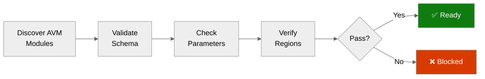

# ✅ Step 4b: Pre-Flight AVM Check - Malta Catering

<strong>📑 Pre-Flight Contents</strong>

- [🎯 Purpose](#-purpose)
- [✅ AVM Schema Validation Results](#-avm-schema-validation-results)
- [🔎 Parameter Type Analysis](#-parameter-type-analysis)
- [🌍 Region Limitations Identified](#-region-limitations-identified)
- [⚠️ Pitfalls Checklist](#-pitfalls-checklist)
- [🚀 Ready for Implementation](#-ready-for-implementation)

> Generated by bicep-code agent | 2026-04-14
> Status: **PASS**

| ⬅️ Previous | 📑 Index | Next ➡️ |
| --- | --- | --- |
| [04-implementation-plan.md](04-implementation-plan.md) | [README](README.md) | [05-implementation-reference.md](05-implementation-reference.md) |

## 🎯 Purpose

> [!IMPORTANT]
> This checkpoint validates AVM module schemas BEFORE Bicep code generation.

Prevents:

- Parameter type mismatches between planner assumptions and AVM module contracts.
- Unsupported defaults that would silently force extra networking prerequisites.
- Governance drift between resource-group deny tags and child-resource modify tags.
- Security baseline regressions in storage, registry, Key Vault, and Container Apps.

## ✅ AVM Schema Validation Results

| Resource | AVM Module Path | Version | Status |
| --- | --- | --- | --- |
| Log Analytics Workspace | `br/public:avm/res/operational-insights/workspace` | `0.15.0` | ✅ |
| Application Insights | `br/public:avm/res/insights/component` | `0.7.1` | ✅ |
| Key Vault | `br/public:avm/res/key-vault/vault` | `0.13.3` | ✅ |
| Storage Account | `br/public:avm/res/storage/storage-account` | `0.32.0` | ✅ |
| Container Registry | `br/public:avm/res/container-registry/registry` | `0.12.1` | ✅ |
| Container Apps Environment | `br/public:avm/res/app/managed-environment` | `0.13.1` | ✅ |
| Container App | `br/public:avm/res/app/container-app` | `0.22.0` | ✅ |
| Consumption Budget | Native `Microsoft.Consumption/budgets@2024-08-01` | `2024-08-01` | ✅ |

## 🔎 Parameter Type Analysis

<strong>Log Analytics Parameters</strong>

| Parameter | Expected Type | Notes |
| --- | --- | --- |
| `dailyQuotaGb` | `string` | Fractional or whole GB values are strings. |
| `dataRetention` | `int` | 30 days is valid for this demo deployment. |
| `diagnosticSettings.useThisWorkspace` | `bool` | Lets the workspace self-target diagnostics safely. |

<strong>Managed Environment Parameters</strong>

| Parameter | Expected Type | Notes |
| --- | --- | --- |
| `appLogsConfiguration` | `object` with discriminator | Use `destination: 'log-analytics'`. |
| `appLogsConfiguration.logAnalyticsWorkspaceResourceId` | `string` | AVM expects a workspace resource ID, not customer ID/shared key. |
| `zoneRedundant` | `bool` | AVM defaults to `true`; the demo must override to `false` to avoid extra VNet and workload-profile requirements. |

<strong>Container App Parameters</strong>

| Parameter | Expected Type | Notes |
| --- | --- | --- |
| `managedIdentities` | `object` | System-assigned identity is enabled here. |
| `scaleSettings` | `object` | Use `minReplicas` and `maxReplicas`, not flat params. |
| `registries[].identity` | `string` | ACR pull via managed identity uses lowercase `system`. |
| `secrets[].identity` | `string` | Key Vault secret reference uses uppercase `System`. |

<strong>Security Baseline Parameters</strong>

| Resource | Parameter | Required Value |
| --- | --- | --- |
| Storage Account | `minimumTlsVersion` | `TLS1_2` |
| Storage Account | `supportsHttpsTrafficOnly` | `true` |
| Storage Account | `allowBlobPublicAccess` | `false` |
| Storage Account | `allowSharedKeyAccess` | `false` |
| Container Registry | `acrAdminUserEnabled` | `false` |
| Key Vault | `enableRbacAuthorization` | `true` |
| Key Vault | `enablePurgeProtection` | `true` |
| Application Insights | `disableIpMasking` | `false` |

## 🌍 Region Limitations Identified

| Resource | Default Region | Limitation | Action |
| --- | --- | --- | --- |
| All planned services | `swedencentral` | No region blocker found for the selected SKUs and resource set. | Keep single-region deployment in `swedencentral`. |
| Container Apps Environment | `swedencentral` | AVM default `zoneRedundant: true` would force extra infrastructure inputs. | Explicitly set `zoneRedundant: false`. |
| Container Registry (Basic) | `swedencentral` | Premium-only network controls such as private endpoints and public network access flags are not part of the selected SKU path. | Keep Basic SKU and omit Premium-only network settings. |

## ⚠️ Pitfalls Checklist

- [x] Log Analytics `dailyQuotaGb` uses string type.
- [x] Container App Environment uses `appLogsConfiguration` with `logAnalyticsWorkspaceResourceId`.
- [x] Container App uses `scaleSettings` object.
- [x] App Insights uses `connectionString`; no deprecated instrumentation-key-only pattern is introduced.
- [x] Managed identity is used for Container App secrets and ACR pull configuration.
- [x] Resource-group deny-policy tags are applied before deployment in `deploy.ps1`.
- [x] Child resources include both `technical-contact` and `tech-contact` tags to bridge modify-policy drift.
- [x] Storage hardening is explicit rather than relying on defaults.
- [x] Key Vault deployment-only legacy switches are disabled because this demo does not need them.

## 🚀 Ready for Implementation

| Check | Status | Notes |
| --- | --- | --- |
| All AVM modules verified | ✅ | 7 AVM-backed resources validated. |
| Parameter types confirmed | ✅ | Module-specific pitfalls translated into wrapper inputs. |
| Region limitations handled | ✅ | No blocker for `swedencentral`; SKU-specific caveats handled in code. |
| Governance gate satisfied | ✅ | Deny-policy requirement is met by pre-tagging the resource group. |
| Pitfalls addressed | ✅ | No unresolved AVM or policy blocker remains. |

> [!IMPORTANT]
> **Go / No-Go Verdict**
>
> | Signal | Status |
> | --- | --- |
> | AVM Modules | ✅ |
> | Parameters | ✅ |
> | Regions | ✅ |
> | Governance | ✅ |
> | **Overall** | **✅ READY** |
>
> No unresolved blocker remains for Step 5 code generation.

---

_Pre-flight validation for Malta Catering Bicep implementation_

---

| ⬅️ [04-implementation-plan.md](04-implementation-plan.md) | 🏠 [Project Index](README.md) | ➡️ [05-implementation-reference.md](05-implementation-reference.md) |
| --- | --- | --- |

