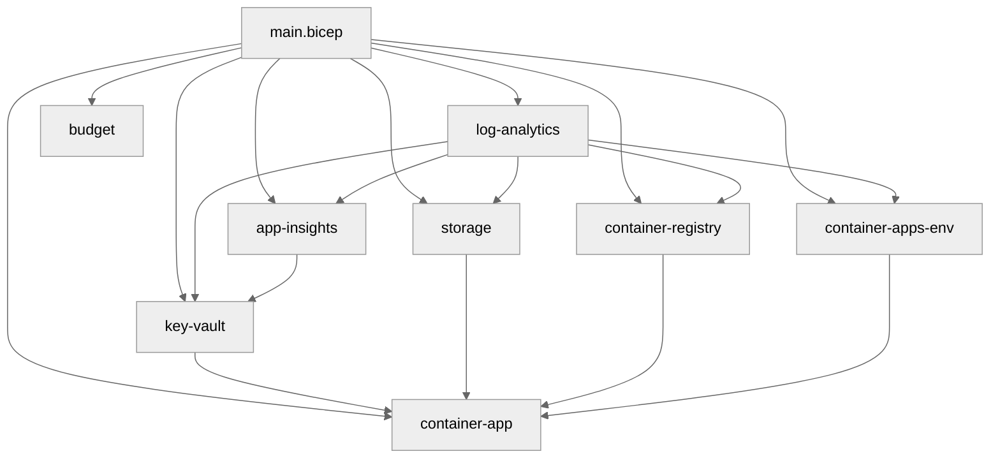

# 💻 Step 5: Implementation Reference - Malta Catering


<details open>
<summary><strong>📑 Implementation Reference</strong></summary>

- [📁 IaC Templates Location](#-iac-templates-location)
- [🗂️ File Structure](#-file-structure)
- [✅ Validation Status](#-validation-status)
- [🏗️ Resources Created](#-resources-created)
- [🚀 Deployment Instructions](#-deployment-instructions)
- [📝 Key Implementation Notes](#-key-implementation-notes)

</details>

> Generated by bicep-code agent | 2026-04-14

| ⬅️ Previous | 📑 Index | Next ➡️ |
| --- | --- | --- |
| [04-preflight-check.md](04-preflight-check.md) | [README](README.md) | [06-deployment-summary.md](06-deployment-summary.md) |

## 📁 IaC Templates Location

📁 **Code Location**: [`infra/bicep/malta-catering/`](../../infra/bicep/malta-catering/)

## 🗂️ File Structure

```text
infra/bicep/malta-catering/
├── main.bicep
├── main.bicepparam
├── azure.yaml
├── deploy.ps1
└── modules/
    ├── app-insights.bicep
    ├── budget.bicep
    ├── container-app.bicep
    ├── container-apps-env.bicep
    ├── container-registry.bicep
    ├── key-vault.bicep
    ├── log-analytics.bicep
    └── storage.bicep
```

## ✅ Validation Status

| Check | Result | Details |
| --- | --- | --- |
| `bicep build` | ✅ | Passed. Only upstream AVM `BCP081` warnings remain for Container Apps preview types. |
| `bicep lint` | ✅ | Passed. No local lint violations remain. |
| `validate:iac-security-baseline` | ✅ | Passed after resolving tag casing and public network access hard gates. |
| `lint:artifact-templates` | ✅ | Passed with one non-blocking documentation warning addressed in this artifact. |
| `what-if` | ⏭️ | Deferred to Step 6 deployment workflow. |

## 🏗️ Resources Created

| Resource | Bicep Type | Module |
| --- | --- | --- |
| Log Analytics Workspace | `Microsoft.OperationalInsights/workspaces` | `modules/log-analytics.bicep` |
| Application Insights | `Microsoft.Insights/components` | `modules/app-insights.bicep` |
| Key Vault + secret | `Microsoft.KeyVault/vaults` | `modules/key-vault.bicep` |
| Storage Account + tables | `Microsoft.Storage/storageAccounts` | `modules/storage.bicep` |
| Container Registry | `Microsoft.ContainerRegistry/registries` | `modules/container-registry.bicep` |
| Container Apps Environment | `Microsoft.App/managedEnvironments` | `modules/container-apps-env.bicep` |
| Container App + RBAC | `Microsoft.App/containerApps` | `modules/container-app.bicep` |
| Consumption Budget | `Microsoft.Consumption/budgets` | `modules/budget.bicep` |



## 🚀 Deployment Instructions

<details>
<summary><strong>🟢 Quick Deploy (PowerShell)</strong></summary>

```powershell
cd infra/bicep/malta-catering
./deploy.ps1 -Owner "team@example.com" -CostCenter "demo-001" -TechnicalContact "ops@example.com" -BudgetContactEmails "ops@example.com"
```

</details>

<details>
<summary><strong>🔍 Preview Changes (What-If)</strong></summary>

```powershell
./deploy.ps1 -Owner "team@example.com" -CostCenter "demo-001" -TechnicalContact "ops@example.com" -BudgetContactEmails "ops@example.com" -WhatIfDeployment
```

</details>

<details>
<summary><strong>⚙️ Custom Parameters</strong></summary>

```powershell
./deploy.ps1 `
    -ResourceGroupName "rg-malta-catering-dev" `
    -Location "swedencentral" `
    -Environment "dev" `
    -Phase "compute" `
    -ContainerImageTag "release-2026-04-14"
```

</details>

<details>
<summary><strong>🚀 Azure CLI</strong></summary>

```bash
az deployment group create \
  --resource-group rg-malta-catering-dev \
  --template-file infra/bicep/malta-catering/main.bicep \
  --parameters infra/bicep/malta-catering/main.bicepparam \
  --parameters phase=all owner=team@example.com costcenter=demo-001 technicalContact=ops@example.com budgetContactEmails='["ops@example.com"]'
```

</details>

## 📝 Key Implementation Notes

| Note | Impact | Reference |
| --- | --- | --- |
| `uniqueSuffix` is generated once and reused for globally unique names. | Stable naming across Key Vault, Storage, and ACR. | `main.bicep` |
| Phase selection includes prerequisites implicitly in code ordering. | Later phases can redeploy safely without broken outputs. | `main.bicep` |
| Resource-group deny-policy tags are applied in `deploy.ps1` before Bicep runs. | Prevents hard-fail on first deployment. | `deploy.ps1` |
| Key Vault stores the Application Insights connection string for the app to resolve through managed identity. | Avoids inline secret values in Container App configuration. | `modules/key-vault.bicep`, `modules/container-app.bicep` |
| Container App RBAC is created after the app identity exists. | Grants `AcrPull`, `Key Vault Secrets User`, and `Storage Table Data Contributor`. | `modules/container-app.bicep` |

```bicep
var uniqueSuffix = take(toLower(uniqueString(resourceGroup().id)), 6)
```

⚠️ Remaining compiler output is limited to `BCP081` warnings from the AVM Container App module because the underlying preview resource types do not currently ship full Bicep type metadata.

❌ No blocking Step 5 validation failures remain.

---

_Implementation reference generated from Bicep templates._

---

<div align="center">

| ⬅️ [04-preflight-check.md](04-preflight-check.md) | 🏠 [Project Index](README.md) | ➡️ [06-deployment-summary.md](06-deployment-summary.md) |
| --- | --- | --- |

</div>